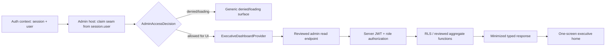

# معمارية المركز التنفيذي — Phase II

**السند:** `main@cc60adfc0da0f893b101230269d4847d33490429`

**النوع:** تصميم تنفيذي مستقل، بلا كود تطبيق أو Backend

**عقد البيانات:** [`../../../product/EXECUTIVE-DASHBOARD-DATA-CONTRACT-V2.md`](../../../product/EXECUTIVE-DASHBOARD-DATA-CONTRACT-V2.md)

## 1. الهدف والحد

المركز التنفيذي سطح داخلي يجيب من شاشة واحدة: ما حالة المنتج، ما الذي تغيّر،
ما الذي يحتاج انتباهًا، وأين يمكن التعمق. هذه الوثيقة تصف حدود البناء القادم؛
لا تعني أن السطح موصول أو أن مصادره الحية موجودة.

داخل النطاق:

- قشرة سطح مكتب أولًا مع quick view صادق على iPad وiPhone.
- بوابة وصول fail-closed.
- مزوّد بيانات typed يفصل fixtures عن live.
- KPIs واتجاهات وطابور انتباه وقائمة مستخدمين مصغرة.
- العربية أولًا والإنجليزية كاملة.

خارج النطاق الحالي:

- أي endpoint أو migration أو RLS policy.
- route داخل التطبيق قبل اعتماد HEAD النهائي للـWeb Sovereign.
- أي write/grant/revoke/delete/force logout/resend activation.
- عرض قيم صحية فردية أو أسرار أو مفاتيح مميزة.

## 2. حدود الثقة

الحدود الحاكمة:

1. `Admin host` يأخذ claim من `session.user.app_metadata`، لا من `session` الأعلى.
2. `AdminAccessDecision` يمنع الرسم والطلب، لكنه لا يمنح صلاحية للخادم.
3. endpoint يعيد التحقق من JWT والدور لكل طلب؛ لا يقبل role من body/query.
4. data layer يعيد aggregates وحقولًا مصغرة فقط.
5. fixture provider لا يُفعّل تلقائيًا عند فشل live provider.

## 3. المكونات المستقبلية المقترحة

الأسماء التالية حدود معمارية، وليست ملفات أُنشئت في هذه الموجة:

| Boundary | Responsibility | Must not do |
|---|---|---|
| `AdminHost` | يقرأ auth، يطبّع `session.user`، يبني قرار UI، يختار provider | لا يقرأ Supabase tables ولا يفسر metrics |
| `AdminAccessPolicy` | يحول claim موثوقًا إلى `AdminAccessDecision` بعد اعتماد سياسة الدور | لا يقرأ `user_metadata` ولا البريد |
| `ExecutiveDashboardProvider` | واجهة read-only typed للصفحة والقائمة والتفصيل | لا يقرر role ولا يسقط إلى fixtures |
| `LiveAdminProvider` | يستدعي endpoints مراجعة ويحول الرد إلى العقد | لا يحمل `service_role` ولا يستدعي DB مباشرة |
| `FixtureAdminProvider` | يشغل السيناريوهات الصريحة في dev/test فقط | لا يدخل production path ولا يعالج أخطاء live |
| `ExecutiveHome` | يعرض الحالة العامة في شاشة واحدة | لا يعيد تعريف metrics ولا يخترع قيمًا |
| `AdminUserExplorer` | بحث وفرز وتصفية وتصفح/virtualization | لا يحمل بريدًا كاملًا أو تفاصيل صحية |
| `AdminUserDetail` | deliberate drill-down محدود | لا يُحمّل مع جدول المستخدمين |

## 4. دورة القرار والتحميل

### 4.1 الوصول

1. يبدأ auth بحالة loading.
2. host لا ينشئ provider request قبل قرار `allowed`.
3. claim غائب أو ذاتي أو غير معروف أو سياسة دور غير محسومة ⇒ denied.
4. denied page عامة؛ لا تعرض claim name أو provisioning state أو metrics.
5. بعد قرار UI المسموح، الخادم يقرر مرة أخرى من JWT.

### 4.2 البيانات

الحالات العليا الوحيدة هي:

- `denied`
- `loading`
- `empty`
- `partial`
- `error`
- `ready`

`empty` نتيجة authoritative query ناجحة لا fixture ولا fallback. `partial` تحمل
missing sections وquality/coverage. `error` لا يعرض snapshot قديمة بلا وسم stale.

### 4.3 الإلغاء والتزامن

- كل انتقال route أو filter كبير يلغي الطلب السابق عبر `AbortSignal`.
- النتيجة الأقدم لا تستبدل نتيجة أحدث.
- refresh موجود فقط حين يوجد handler حيّ، ويعلن loading/freshness.
- تفاصيل المستخدم تُطلب عند الفتح ولا تُسبق تحميلًا لكل الصفوف.

## 5. تصميم الشاشة الواحدة

المسار التنفيذي صفحة واحدة مع progressive disclosure، لا ثلاث وجهات تخفي
الإجابة الأساسية:

1. **System strip:** build/source status، لحظة القياس، freshness، أجزاء blind.
2. **Attention first:** critical/warning ثم unmonitorable المعلن.
3. **KPI strip:** الحسابات، الدخول، الاستحقاق، التفعيل، النشاط المسموح، onboarding.
4. **Trends:** growth، active، conversion، funnels، workouts، nutrition، retention
   فقط إذا امتلك كل واحد series صحيحة مستقلة.
5. **Needs attention:** قائمة قصيرة مصغرة بأسباب مسماة.
6. **Recent operations:** أحداث تشغيلية مجمعة، لا سجل مستخدم حساس.
7. **User explorer:** منطقة قابلة للتوسعة أو drawer/section ضمن نفس السطح.

يجوز استخدام tabs داخلية لتقليل الكثافة، لكن home يبقى قادرًا على الإجابة عن
الصحة العامة والتنبيهات والاتجاهات ومن يحتاج انتباهًا دون فتح tab آخر.

## 6. عقد الرسوم

كل chart يطلب نوعًا خاصًا بالمقياس:

- `UserGrowthSeries`
- `SignedInSeries`
- `PremiumConversionSeries`
- `ActivationFunnel`
- `OnboardingFunnel`
- `WorkoutCompletionSeries`
- `NutritionLoggingSeries`
- `RetentionCohortMatrix`

لا يوجد `GenericSeries` يُمرر لكل الرسوم بلا فحص metric identity. يرفض adapter
البيانات إن اختلف `metricName` أو `definitionVersion`. لا يجوز تمرير active
series إلى workout أو retention وتغيير العنوان فقط.

لكل رسم بديل نصي/جدولي قابل للقراءة، ووصف يذكر الوحدة والنافذة و`asOf`، لا
`aria-label` من min/max فقط.

## 7. الخصوصية وتقليل البيانات

- الصفحة الأولى aggregates فقط عدا قائمة attention مصغرة ومصرح بها.
- جدول المستخدمين: safe id، اسم عرض، بريد مقنع، حالات الحساب/الاستحقاق/التفعيل،
  timestamps وملخصات أحداث فقط.
- البريد الكامل غير مطلوب في payload القائمة. كشفه، إن أُقر مستقبلًا، عملية
  مستقلة مدققة لا default rendering.
- اللغة والمنصة لا تعرضان إلا إذا كانتا موجودتين ومصرحًا بجمعهما؛ لا fingerprint.
- الوزن ومحيط الجسم والإصابات والأدوية والمكملات والحساسيات وأسماء الأطعمة خارج
  الحمولة التنفيذية.
- لا payload أو بريد أو user id أو activation code في console أو telemetry.

## 8. عناصر التحكم

Phase II هنا read-first. القاعدة البنيوية:

- handler غائب ⇒ control غير موجود.
- capability غير مراجعة ⇒ roadmap text، لا disabled button يوهم بقدرة.
- refresh/open/filter يظهر فقط إذا كان مصدره وفعلُه موجودين.
- إذا أصبح فعل إداري متاحًا مستقبلًا، يحتاج server capability مراجعة، تأكيدًا
  صريحًا، audit trail، idempotency، ونتيجة فشل صادقة. هذا ليس ضمن هذه الموجة.

## 9. RTL والوصولية والاستجابة

### 9.1 RTL واللغة

- `dir` يأتي من مزود اللغة على جذر السطح.
- خصائص منطقية فقط: start/end و`ms/me/ps/pe`.
- أيقونات الاتجاه والعودة تتبدل حسب `dir`.
- الزمن في الرسوم يُرتب حسابيًا، والنص لا يُعكس بمرآة CSS.
- الأرقام والتواريخ لها locale/time-zone معلنان، وتعريف «اليوم» يستخدم الرياض.
- العربية والإنجليزية تحملان المعنى نفسه ولا تخلطان السجلين في الشاشة.

### 9.2 الوصولية

- كل هدف لمس 44×44px على الأقل.
- landmarks وعناوين وتسلسل heading واضح.
- tabs، إن استُخدمت، تطبق نمط tabs القياسي مع الأسهم والتركيز.
- الانتقال إلى تفصيل المستخدم ينقل التركيز إلى عنوانه؛ الرجوع يعيده إلى الصف.
- تحديث الحالة يعلن عبر live region دون تكرار مزعج.
- الجداول لها captions/headers صحيحة؛ الرسوم لها data alternative.
- سبب عدم إتاحة filter نص مرئي مرتبط بـ`aria-describedby`، لا `title` على زر disabled.
- لا اعتماد على اللون وحده، وcontrast AA يثبت في browser.

### 9.3 الاستجابة

- `>=1280`: كامل الأعمدة والاتجاهات جنبًا إلى جنب.
- `820`: KPI grid مختصر، والجداول تختار الأعمدة الأساسية مع disclosure.
- `390`: quick view حقيقي: alerts + KPIs + compact attention؛ user rows cards أو
  جدول بأعمدة حرجة، لا مجرد `min-width` وتمرير أفقي 720px.
- اختبارات viewport يجب أن تستخدم layout engine في متصفح، لا أغلفة HTML ثابتة.

## 10. مراقبة الجودة

كل response يحمل:

- `asOf`
- `sourceVersion`
- `freshness`
- `quality.status`
- coverage numerator/denominator حيث ينطبق
- caveats

تظهر stale/partial/unmonitorable صراحةً. ولا تتحول حالة خط pipeline إلى «لا
تنبيهات». طبقة العرض لا تعيد حساب التعريفات؛ تستهلك registry versioned.

## 11. ترتيب التنفيذ بعد فك الحجب

1. اعتماد `WS-001` ثم إعادة ربط حارة Phase II على HEAD المعتمد.
2. حسم `ADM-001` وتصميم claim/server authorization.
3. تثبيت provider interface وحالات الحمولة بلا route.
4. بناء fixture provider واختبارات العقد والمتصفح.
5. بناء UI الشاشة الواحدة بمصادر unavailable الصادقة.
6. بعد قبول endpoints فقط: live provider واختبارات server integration.
7. route integration موجة صغيرة مستقلة بعد فحص Web head.

## 12. الاعتماديات

| Dependency | Owner | Status | Acceptance Evidence | Notes |
|---|---|---|---|---|
| `WS-001` — HEAD نهائي معتمد للـWeb Sovereign | Founder / Coordinator | BLOCKED | SHA معتمد وCI أخضر مقروء | لا route/rebase/copy قبله |
| `ADM-001` — سياسة الدور الإداري | Founder / Security | OPEN | قرار يحدد founder/admin والclaim | fail closed حتى القرار |
| `ADM-002` — claim server issuance | Backend / Auth | EXTERNALLY_BLOCKED | JWT fixture واختبار عدم self-assertion | `session.user` هو seam |
| `ADM-003` — reviewed read endpoints | Backend / Security | EXTERNALLY_BLOCKED | API + authorization + RLS review | شرط live provider |
| `ADM-004` — account-source reconciliation | Backend / Data | OPEN | تقرير count/backfill/reconciliation | يمنع totals غير الموثوقة |
| `ADM-005` — entitlement/activation source | Backend / Commerce | MISSING_SOURCE | schema + audit + endpoint acceptance | يمنع commerce KPIs |
| `ADM-006` — consent-aware activity basis | Founder / Product / Privacy | NEEDS_DECISION | مقام وتغطية وموافقة معتمدة | يمنع activity ratios |
| `ADM-007` — independent onboarding signal | Founder / Product | NEEDS_DECISION | contract واختبار مستقل عن sync | يمنع completion bias |
| `ADM-008` — runtime posture source | Release / Backend | OPEN | build/sync state من البيئة الفعلية | لا استنتاج من template |
| `ADM-009` — operational signal sources | Backend / Data / Release | OPEN | provenance/threshold/asOf لكل signal | attention يبقى unmonitorable |

## 13. قرار الجاهزية

**Architecture-ready، وليس live-ready.** هذه الوثيقة صالحة لبناء الحدود المستقلة
والfixtures والاختبارات. الوصل بالخادم أو القشرة محجوب بالاعتماديات أعلاه، ولا
يجوز تفسير وجود التصميم بوصفه إثبات صلاحية أو بيانات إنتاجية.
