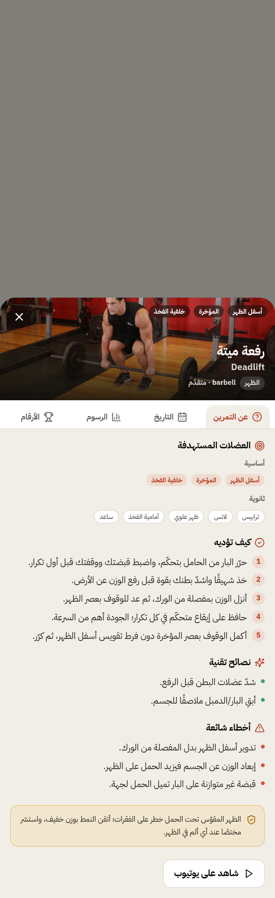
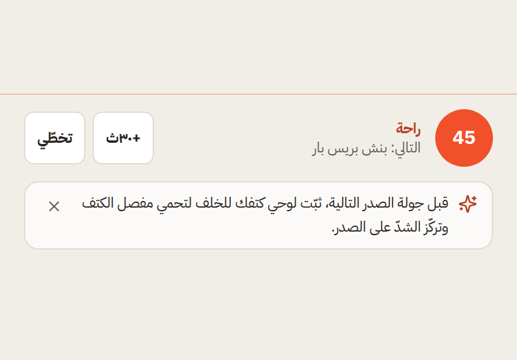
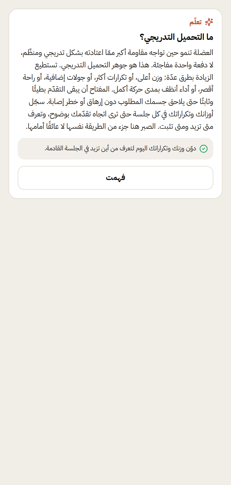

# Qimmah — Arabic Coaching Layer

Structured, honest fitness guidance woven into the app. **Not a chatbot, not medical advice.**
All content is warm MSA (per the tone rules): zero slang, zero hype, zero medical claims; injuries
route to «استشر مختصًا», and every physiological statement is conservative mainstream consensus.

## What ships
| Content | Count | File |
|---|---|---|
| Per-exercise form cues (3–5 steps + 2–3 mistakes + 1 safety) | **181/181** | `src/data/coaching/exerciseCues.generated.ts` |
| Educational micro-lessons (60–100 words + one takeaway) | **40** | `src/data/coaching/lessons.ts` |
| Rest-period contextual tips (muscle-keyed) | **25** | `src/data/coaching/restTips.ts` |

Topics for lessons: progressive overload · rest · protein timing · sleep · plateaus · deloads ·
hydration · soreness-vs-pain (5 each).

## How the 181 cues are authored
Hand-typing 181 unique cue sets is neither maintainable nor reviewable, so cues are **composed** by
`scripts/coaching/build-cues.mjs` from a curated Arabic fragment library keyed by **equipment ×
movement-pattern × primary-muscle**, with a deterministic per-id variant pick (FNV-1a hash) so cues
read specifically and never repeat verbatim within a muscle group — yet are fully reproducible.
Unilateral moves get a “switch sides” step; spine/knee-loading patterns (hinge/squat) route the
safety line to «استشر مختصًا». The composer materialises a **static** data file
(`exerciseCues.generated.ts`); the runtime only does a lookup. Regenerate with `npm run coaching:build`
(re-extracts the catalog manifest first, so coverage tracks the live 181-exercise catalog).

## Selection engine (pure, testable) — `src/lib/coaching/`
- **`cues.ts`** — `getCue(id)` / `hasCue(id)`; a `FALLBACK_CUE` exists only as a safety net and is
  **unreachable** when coverage is complete (the proof enforces 181/181).
- **`restTips.ts`** — `pickRestTip(muscle, seed, shown)`: matches the current exercise's muscle group,
  no-repeat within a session until the pool is exhausted (then resets), deterministic given inputs,
  falls back to the full set for an unmatched muscle so a rest always has a line. No side effects —
  the caller tracks `shown` in session state.
- **`lessonRotation.ts`** — `selectNextLesson(shown, seed)` (pure: no-repeat-until-exhausted, then a
  fresh cycle, deterministic) + owner-scoped persistence (`currentTodayLesson`, `markLessonUnderstood`)
  under `qimmah:coach:lessons:v1:<userId>`, so two accounts on one device rotate independently.
- **`hash.ts`** — FNV-1a, the seedable determinism primitive (no `Math.random`).

## UI touchpoints (RTL, AA, reduced-motion)
1. **Exercise detail «كيف تؤديه»** — `src/components/ExerciseDetail.tsx`: the authored cue (numbered
   steps + mistakes + safety) on the light detail surface in Arabic; English keeps the existing
   bilingual generic guidance. 
2. **Rest-period tip** — `src/components/WorkoutMode.tsx`: a subtle, **dismissible** line on the dark
   Active-Workout surface, picked for the current exercise's muscle, no-repeat within the session;
   entrance animation is `motion-safe` only. 
3. **Today «تعلّم» card** — `src/components/coaching/TodayLearnCard.tsx` (rendered in `TodayV2`): one
   micro-lesson with a **«فهمت»** action that advances the per-account rotation. 

## Honesty constraints (enforced)
No revenue/results promises, no «احرق دهون بسرعة», no guarantees. `npm run test:coaching` fails on any
banned substring (`وش`, `الحين`, `تبي`, `كذا`, `احرق`, `مضمون`), on any `!`, on medical-claim phrases,
and asserts spine/knee cues include the consult line.

## Tests — `npm run test:coaching` (25 checks, hard-fail)
1. **181/181 cue coverage** (hard fail on any gap) + no orphan cues + structure bounds (3–5/2–3/1).
2. **Content lint** across all 1,765 strings: banned slang/hype, exclamation, medical claims.
3. **Lessons**: exactly 40, each **60–100 words**, unique ids, every lesson has a takeaway.
4. **Rest tips**: exactly 25, each muscle-keyed, unique ids.
5. **Rest-tip picker**: determinism + no-repeat-until-exhausted + reset + unmatched-muscle fallback.
6. **Lesson rotation**: no-repeat across all 40 then reset, determinism.
7. **Two-user isolation**: owner-scoped keys keep A's and B's rotation (and the guest's) independent.

## Scope notes
No sync/auth/dependency changes. Two `package.json` **scripts** were added (`coaching:build`,
`test:coaching`) — the minimal wiring required to build and prove the layer. Content is Arabic; the
cue section and Today card render in Arabic mode (English keeps existing generic guidance).
