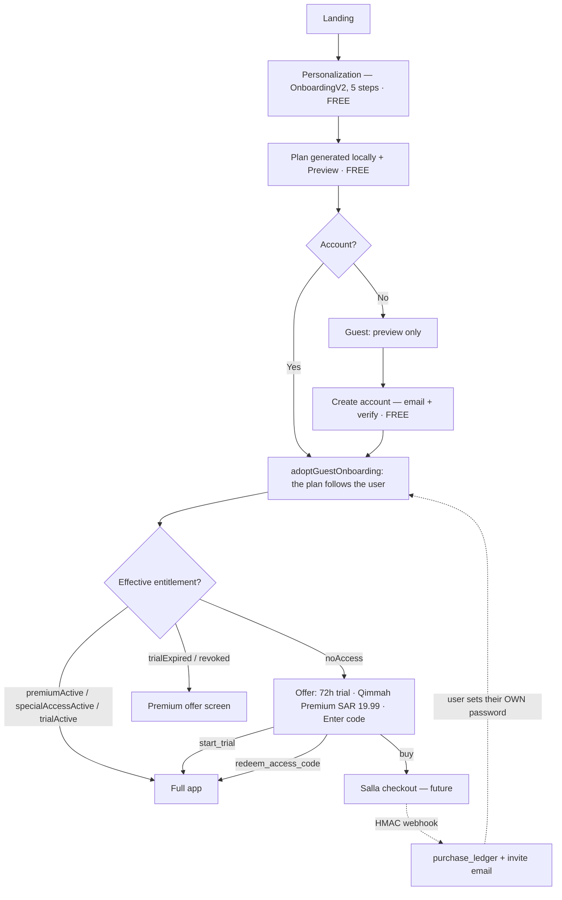

# قِمّة — Access, Trials & Activation: Verified Report + Approved Architecture

**Revision 4** — 2026-08-09. Revision 3 (2026-08-09) reconciled the founder decision record with Line B; this revision records its controlled integration on `codex/qimmah-integration` after the accepted Golden portability baseline `90999bcb575873713750fa1c1df146a833461eb2`.
**Ground truth:** the migrations and proof suites in the controlled integration lineage (including immutable Line B `df85c77006b5e132cd78649af39cd550331976c7`, based on `main` @ `dd79a60`). Where this document and the migrations disagree, **the migrations win** — §7 marks the superseded parts explicitly.

## Status — implemented · tested · proposed · deferred

| Layer | Status | Where |
|---|---|---|
| P2 schema (tables, RLS, privileges, pepper) | ✅ **Implemented** | `supabase/migrations/20260806120001_entitlements_core.sql` · `…120003_table_privileges_hardening.sql` |
| P2 RPCs (trial, redeem, claim, admin) | ✅ **Implemented** | `…20260806120002_entitlement_rpcs.sql` |
| Durable revocation contract (`revocation_ledger`, `admin_unrevoke`) | ✅ **Implemented** — active ledger outranks every grant | `…20260809120001_revocation_ledger.sql` · `…120004_entitlement_security_remediation.sql` |
| Post-deletion recovery: Premium **and** eligible code grants | ✅ **Implemented** — recovery retains the original provider | `…20260809120002_code_grant_recovery.sql` · `…120004_entitlement_security_remediation.sql` |
| Executable proofs on real Postgres | ✅ **Tested** — `test:entitlements` (157 checks) + `test:privileges` (38), both in `test:gate` | `scripts/db/entitlements-proof.mjs` · `scripts/db/privileges-proof.mjs` |
| Staging apply of the migrations | ⏳ **Not done** — founder-gated (live-DB migration) | — |
| Privacy disclosure UI (§11.1) | 📋 **Deferred to P2b** — proposal written, no UI yet | [`P2B-PRIVACY-DISCLOSURE-PROPOSAL.md`](./P2B-PRIVACY-DISCLOSURE-PROPOSAL.md) |
| P3–P7 (config, provider, gate, UI, admin scripts, Salla) | 📋 **Proposed only** — nothing started | §13 |
| Per-IP / per-request rate limiting | ⛔ **Explicit external blocker** — outside PostgreSQL's reach; see §11.2 | — |

Historical-report sections (§1–§3, §12) remain as verified on 2026-08-06 against `main` @ `dd79a60` and are not re-verified here.

---

## الخلاصة بالعربي

1. **الإصدار الحالي:** `main` @ `dd79a60`؛ آخر التزام وظيفي `0d7d84f` الموسوم `v1.0-rc`.
2. **مكتبة التمارين:** موجودة وصحّية (١٨١ تمرينًا · ٤٠ جهازًا · ١٢١ بوسائط حقيقية). الذي فُقد وسائطها المتحرّكة — **٦١ GIF** حُذفت في `bf07512` لأنها من WorkoutX بعلامة مائية. **قرار مؤسس: لا تُستعاد.**
3. ~~لا يوجد نظام اشتراك/تفعيل/تجربة في المستودع إطلاقًا~~ — **كان صحيحًا يوم كتابته (٦ أغسطس) وتجاوزه الواقع**: طبقة قاعدة البيانات كاملة (مخطّط + دوال + إثباتات منفَّذة) موجودة في خطّ التكامل المراجع. ما لم يُبنَ بعد: أي واجهة أو بوابة أو مسار سلة (P3–P7).
4. **محرّك التخصيص التكيّفي (١٩٣ سؤالًا) لا يصل المستخدم** — **قرار مؤسس: لا يُفعَّل في هذا البرنامج.** الحيّ هو `OnboardingV2` ويبقى كما هو.
5. **فرع `Qimmah-App` غير المدموج: انتهى الخطر.** التحقّق أثبت أن **٢٤ ملفًا من ٣٥ مطابقة حرفيًا** لـ`main`، والباقي `main` **متقدّم عليه**. لا عمل فريد باقٍ ولا تعارض — §12.
6. **قرارات المؤسس مقفلة** — §4. والتسمية للمستخدم **«قِمّة Premium»** بنصّ معتمد واحد — §4.5.

---

# 1. Verified previous-version report *(SYSTEM 1)*

## 1.1 Repository topology

| Fact | Value | Verified by |
|---|---|---|
| Remote | `github.com/km5g98str4-commits/qimmah.git` | `git remote -v` |
| Trunk | `main` @ `dd79a60` (2026-08-04 08:20) | `git log -1 main` |
| Last **functional** commit | `0d7d84f` (`[CTO-76]`) — the 4 above it are `docs(repo)` only | `git log main` |
| Release tag | `v1.0-rc` → `0d7d84f` | `git log -1 v1.0-rc` |
| `design/v21-promotion` local ref | `cc96d84` (2026-07-21) — **stale by 305 commits** | `git rev-list --left-right --count main...design/v21-promotion` → `305 / 0` |
| Promotion's real tip at export | `e1ab6c6` (2026-07-31) — **already an ancestor of `main`** | `git merge-base --is-ancestor` → true |

**`main` is the sole frontier.** Nothing on `design/v21-promotion` is missing from it. ⚠️ The stale local ref is a live trap for the next agent — it points 305 commits behind reality.

## 1.2 "The previous version, especially the one with the exercise library"

Two defensible readings; both named precisely, neither guessed.

**(a) Previous release marker on `main`'s lineage:** `nard-complete-2026-08-02` @ `0b57f2e`, preceded by six `nard/wave-*-done` tags of the same day. The exercise library is unchanged across that boundary — nothing lost.

**(b) The version where the library was materially richer — this is the real finding:**

`pre-phase6-release` @ `d240147` (2026-07-01) — *"Release: 60 animated WorkoutX exercise GIFs, uniform 360x360, gif-first media chain"*.

| Asset | `pre-phase6-release` | `main` today |
|---|---:|---:|
| `public/exercise-gifs/` | **61 files** | **0** (`.gitkeep` only) |
| `public/exercise-images/` | **272 files** | **250** (125 exercises × 2 frames) |

**Removal:** `bf07512` (2026-07-05) — *"fix(P0): launch-blocker wave — … **watermark removal** …"*, 81 files deleted. Reason quoted from `src/data/exerciseGifs.ts:1-8`: the GIFs came from WorkoutX (`api.workoutxapp.com`), carried a diagonal watermark, and the source is proprietary.

> ✅ **FOUNDER DECISION — LOCKED:** *"Do not restore WorkoutX GIFs or any proprietary/watermarked assets."* Closed. Not revisited. Any future animated media requires a new rights-clean source, evaluated on its own.

## 1.3 Login and account creation — current state

`src/lib/authContext.tsx` — Supabase email + password: `signUp` · `signIn` · `resetPassword` (via `VITE_RESET_REDIRECT_URL`) · `updatePassword` · `delete_own_account` RPC.
`src/views/LoginView.tsx` (375 lines) — modes `login | signup | forgot`. `VerifyEmailView.tsx` — email confirmation gate exists.
**No magic-link / OTP path today** — both are Supabase-native and additive.
Every call is wrapped in `guardedAuthCall(...)` + `localizedAuthError(...)`: bilingual, non-leaking auth errors already exist. **Reuse this layer; do not build a second one.**

## 1.4 Existing subscription / activation logic — none

Exhaustive grep of `src/`, `scripts/`, `supabase/` for `entitlement|subscription|salla|billing|paywall|trial|activation` yields only:

1. `src/lib/profileV2Model.ts:209-215` — a decorative "قِمّة+" line, `enabled: false`, *"no real subscription — informational only"*, rendered at `src/views/ProfileV2.tsx:148-157`.
2. `src/lib/authContext.tsx:205` — RxJS-style `.unsubscribe()`. False positive.
3. `VITE_CHECKOUT_URL` → `src/config/product.ts:18` `checkoutUrl`, defaulting to `'#goal'`. **Read by nothing.** Dead seam.

**There is no server-side compute in this project.** Cloudflare Pages serves a static `dist/` (`wrangler.toml`); Supabase is the only backend; `supabase/` holds `migrations/` and **no Edge Functions**. This is the single hardest constraint on the design.

## 1.5 What to preserve (verified, reuse as-is)

| Asset | Path | Role in this program |
|---|---|---|
| Guest→account adoption | `src/lib/onboarding.ts:161-169`, called `App.tsx:254,295` | **Already the "don't lose the plan on activation" mechanism.** Do not rebuild. |
| Account-switch isolation | `src/lib/accountScope.ts` `reconcileAccountScope()` | Prevents cross-account local leakage. |
| Central key registry | `src/lib/userDataKeys.ts` | Charter rule: every new key registers here. |
| Safe writes | `src/lib/safeStorage.ts` + `WriteResult` | Charter §5 — no swallowed failures. |
| RLS contract | `supabase/migrations/20260726120003_p14_rls_policies.sql` | The exact four-policy shape to copy. |
| Fail-safe deletion | `supabase/migrations/20260713120007_delete_own_account.sql` | ⚠️ Collides with the new schema — §7.1. |
| Bilingual auth errors | `src/lib/authErrors.ts` | Reuse for redemption errors. |

---

# 2. Current personalization status *(deliverable 2)*

## 2.1 The LIVE flow — preserved unchanged

`StartView` → `StartViewV2` · `SetupView` → **`OnboardingV2`** (884 lines).
Five input steps (`LAST_INPUT_STEP = 4`, `src/lib/onboardingV2Flow.ts:155`) + Ready screen:

| Step | Collects | Validation key |
|---|---|---|
| 0 | age · gender · height · weight | `body` / `ageBelowMin` |
| 1 | intent · level · training years | `intentLevel` |
| 2 | goal (minors blocked from `cut`/`bulk`) | `goal` |
| 3 | days (3–6) · duration (30–75) | `training` |
| 4 | place · equipment pref · injuries · health consent | `equipment` / `healthConsent` |

Completion pipeline (`OnboardingV2.tsx:213-246`):

```
toAnswersFromV2 → buildOnboardingProfile → saveOnboardingProfile
  → buildCustomizationFromOnboarding  → applyCustomization → markCompleted(userId)
  → trackLocal('setup_completed')     // only after the plan is genuinely saved
  → persistOnboardingToProfile(userId) // best-effort, signed-in only
  → clearDraftV2(userId)
```

A throw happens **before** `markCompleted`, surfaces a retry screen, and does not enter the app. The draft survives. **This honesty chain is untouchable — the entitlement gate mounts *after* it, never inside it.**

Plan output lands in `qimmah:customization:v1` (`src/lib/customization.ts:22`) via `src/lib/planGenerator.ts`.

> ✅ **FOUNDER DECISION — LOCKED:** *"Preserve the current live OnboardingV2 flow."*

> ✅ **Memory correction (verified):** the old P0 *"onboarding doesn't collect age/gender/height/weight ⇒ identical BMR for everyone"* is **closed on `main`**. Step 0 collects all four. What remains is narrower: `toLegacyProfile` still hardcodes `muscleFocus:'balanced'` (`onboardingProfile.ts:283`), `equipment:[]` (289), `preferredDays:[]` (291) — while `gymAccess`/`gymType`/`workoutEnvironment` **do** derive from the user's answer. Out of scope here; logged as debt.

## 2.2 The DEAD flow — stays dead

`src/lib/personalization/` — 14 modules, **193 questions** (`core` 31 · `goals` 22 · `health` 32 · `logistics` 33 · `preferences` 37 · `advanced` 24 · `clarify` 14).
**Its only consumer in the entire repo is `scripts/personalization-proof.ts`** — verified by grepping every `.ts`/`.tsx` under `src/`. Zero UI imports. Gated by `test:personalization` inside `test:gate`: **proven but unreachable.**

> ✅ **FOUNDER DECISION — LOCKED:** *"Do not activate the unreachable 193-question adaptive engine in this program."* It stays gated and unwired. Wiring it is a separate future program.

---

# 3. Current exercise-library status *(deliverable 3)*

- **Data:** `src/data/exercises.ts` — **181 exercises** (array opens line 238).
- **View:** `src/views/ExerciseLibraryView.tsx` — search · 12 muscle filters · 9 equipment filters derived from data · alphabetical by display language · detail sheet. Second mode: **machine catalog, 40 machines** (`src/data/machineCatalog.ts`).
- **Route:** `#exercises` → `App.tsx:480`, inside `MobileShell` under the `workout` tab. `guardRoute` requires completed onboarding.
- **i18n:** `src/i18n/dict/library.ts`, bilingual.
- **Media:** manifest-driven and honest — **121/181** with real start/end stills; `gif`/`video` are `null` by design. On disk: 125 image folders (250 jpgs) + 24 machine images + **0 GIFs**.
- **Coaching:** `src/data/coaching/exerciseCues.generated.ts` — 181 cues.

**Verdict: healthy, reusable, no changes needed.** It becomes gated content under §4.1 — nothing about the library itself changes.

---

# 4. Founder decision record — LOCKED *(deliverable 1)*

Decisions issued directly by the founder on 2026-08-06. **These are constraints, not options.** Reopening any of them requires a new signed decision.

### 4.1 Gate model — **Preview Gate**

| **Free** — no account, no payment | **Gated** — requires an active entitlement |
|---|---|
| Onboarding / personalization | Entering the full application |
| Local plan generation | Workout |
| **Plan preview** | Nutrition |
| Account creation (email + verification) | Progress |
| | Exercise library & tools, and all other main features |

### 4.2 Access is granted by exactly three means

| Means | Duration | Notes |
|---|---|---|
| Free trial | **exactly 72 hours** from activation | One per **verified** account, ever |
| Premium purchase | never expires | SAR 19.99 — §4.4 |
| Special / influencer code | configurable · **default 14 days** | §7.2 |

### 4.3 "Local-first" is redefined, not dropped — founder's words

> **"Keep local-first as a data-storage and privacy principle, not as a promise that full product access is free."**

Everything local-first actually guarantees **stays true and enforced**: data lives on the device, sync remains optional and consent-gated, charter §5 (storage honesty) and §9 (privacy) are untouched. What changes is only that the charter's phrasing currently reads as a *pricing* promise. §5 gives the exact amendment.

### 4.4 Pricing — one price, everywhere

- **SAR 19.99 Premium, identical on Salla, in the app, and on marketing pages.**
- **SAR 26 is dropped entirely and must appear nowhere.**
- No permanent price differences between purchase channels.
- Price configurable from **one** file — §6.
- Future promotions = **temporary discount campaigns or activation codes**, never a second standing price.

### 4.5 Naming — **"Premium"** *(founder recommendation, adopted; wording finalized 2026-08-06)*

The founder's reasoning: "مدى الحياة" / "lifetime" binds us legally and commercially. Adopted, with a hard boundary between internal and user-facing vocabulary.

**The approved user-facing wording — this string and no other:**

> **«يشمل تحديثات قِمّة — بلا اشتراك شهري»**

**Banned in every user-visible surface** (dictionaries, marketing, Salla product page, emails): `مدى الحياة` · `lifetime` · `كل التحديثات الحالية والمستقبلية`.

> The founder rejected the open-ended "all current and future updates" variant that appeared in revision 1 of this document. It is a promise customers would quote back if Premium were ever narrowed. The approved line keeps the appeal without the commitment; the terms page carries the precise scope.

| Layer | Vocabulary |
|---|---|
| **User-facing** | **«قِمّة Premium» / "Qimmah Premium"** + the approved line above |
| **Internal** (DB columns, state names, types) | `entitlement_type = 'premium'` · `status = 'premiumActive'` · boolean **`no_expiry`** for the technical "this grant never expires" flag |

**Note on the internal flag name.** The original brief specified a "lifetime flag". It is implemented as **`no_expiry`** so the banned word does not exist anywhere in the codebase, not even as a column name that could leak into an API response or an error string. Same semantics, zero leak surface.

**Enforced, not merely intended:** a new gate check `test:premium-copy` fails the build if `مدى الحياة`, `lifetime`, `للأبد`, or `كل التحديثات الحالية` appears in `src/i18n/dict/**` or `site/**`. Per charter §4.2 it ships with a counter-assertion proving the guard actually fires on a planted violation.
>
> ⚠️ **وهذا السطر كان دعوى غير منفَّذة حتى [LIVE-QA-004].** لم يكن في
> `package.json` سكربت بهذا الاسم ولا ملفّ يقابله؛ وقاعدة الكتابة كانت أصدق إذ
> تسمّيه «الحارس المخطَّط». ادّعاءُ إنفاذٍ غير قائم أسوأ من الاعتراف بالغياب:
> من يقرأ هنا يظنّ السطح محروسًا فلا يفحصه. **بُني الحارس فصار السطر صحيحًا** —
> `scripts/run-premium-copy-proof.mjs`، سبعة فحوص منها أربعة تأكيدات مضادّة.

### 4.6 Authentication

> **"Never generate or email passwords. Use secure invitation or password-creation links."**

No password is generated, stored, transmitted, or displayed anywhere in this system. Purchase activation always ends in a **Supabase invite / password-creation link**; the user sets their own secret. This is a hard prohibition, not a preference.

### 4.7 Code impact of the gate — named, not hand-waved

`src/App.tsx:73-86` `guardRoute()` today admits `guestReady` — a guest who finished onboarding — into **every** main tab. Under the Preview Gate that branch changes meaning: a completed guest reaches **preview only**, and `MAIN_TABS` + `exercises` / `stats` / `recovery` / `steps` all require an effective entitlement. **This is the single highest-risk edit in the plan** and carries its own proof (§11-P4).

---

# 5. Exact charter wording changes *(deliverable 2)*

`AGENTS.md` and `CLAUDE.md` are **byte-identical** (verified: `diff -q` → identical) and charter §1.5 requires them to be amended **together**. Three files, four edits. **Founder confirmation required before these are written — the charter is your document.**

### Edit 1 — `CLAUDE.md` **and** `AGENTS.md`, line 11 (§0)

```diff
- عربي أولًا (RTL) مع إنجليزية كاملة. **محلي افتراضيًا مع مزامنة سحابية اختيارية** عند تسجيل الدخول.
+ عربي أولًا (RTL) مع إنجليزية كاملة. **محلي افتراضيًا مع مزامنة سحابية اختيارية** عند تسجيل الدخول.
+
+ > **«محلي افتراضيًا» مبدأ تخزين وخصوصية، لا وعد تسعير.** البيانات على الجهاز، والمزامنة
+ > اختيارية خلف موافقة — وهذا لا يتغيّر. أمّا **الوصول للتطبيق الكامل فمدفوع**: التخصيص
+ > وتوليد الخطة ومعاينتها وإنشاء الحساب مجانية للجميع، وما بعدها خلف تجربة ٧٢ ساعة أو
+ > «قِمّة Premium» أو كود وصول. التفصيل في
+ > [`docs/product/ACCESS-ENTITLEMENT-ARCHITECTURE.md`](./docs/product/ACCESS-ENTITLEMENT-ARCHITECTURE.md).
```

### Edit 2 — `CLAUDE.md` **and** `AGENTS.md`, line 238 (§9)

```diff
- - **الفلسفة المعلنة:** محلي افتراضيًا، مزامنة سحابية اختيارية عند تسجيل الدخول — **أي نص أو كود يخالفها يُصحَّح**.
+ - **الفلسفة المعلنة:** محلي افتراضيًا، مزامنة سحابية اختيارية عند تسجيل الدخول — **أي نص أو كود يخالفها يُصحَّح**.
+   **حدّ القاعدة:** هذه فلسفة **تخزين وخصوصية**. بوابة الوصول المدفوعة (§0) **ليست مخالفة لها**
+   ولا تُصحَّح؛ المخالف هو ما يدّعي أن البيانات على الخادم أو أن المزامنة إجبارية.
```

### Edit 3 — `.claude/rules/product.md`, line 8

```diff
- **محلي أولًا** (local-first): تُحفظ البيانات على الجهاز، **مع مصادقة Supabase ومزامنة سحابية اختيارية خلف علم مطفأ** (`VITE_SYNC_ENABLED` — لا يُفعَّل إلا بإشعار مؤسس صريح، §٣-٥ من دستور الجودة).
+ **محلي أولًا** (local-first): تُحفظ البيانات على الجهاز، **مع مصادقة Supabase ومزامنة سحابية اختيارية خلف علم مطفأ** (`VITE_SYNC_ENABLED` — لا يُفعَّل إلا بإشعار مؤسس صريح، §٣-٥ من دستور الجودة).
+ **«محلي أولًا» يصف أين تعيش البيانات، لا كم يدفع المستخدم.** الوصول الكامل مدفوع — انظر §0 في الميثاق.
```

### Edit 4 — `.claude/rules/product.md`, line 10

```diff
- **ليس قالبًا تجاريًا يُباع.** أي نصّ أو كود أو قاعدة تصفه كذلك **يُصحَّح**.
+ **ليس قالبًا تجاريًا يُباع.** أي نصّ أو كود أو قاعدة تصفه كذلك **يُصحَّح**.
+ التمييز: **المنتج يُباع للمستخدم النهائي (قِمّة Premium)، والكود لا يُباع كقالب لمطوّرين.**
+ لغة «صفحتك/المشتري/معاينة صفحتك» تبقى ممنوعة ويحرسها `test:no-template-language`.
```

**Why edit 4 matters:** without it, the very next agent reads *"ليس قالبًا تجاريًا يُباع"*, sees a purchase flow, and "corrects" it — exactly as §9 instructs. The distinction between *selling the product* and *selling the codebase* has to be written down.

> **Related cleanup, same wave:** `src/config/product.ts:2` still reads *"👈 هذا أول ملف يعدّله المشتري لتخصيص علامته بالكامل"* — genuine leftover template language that violates `product.md` today, independent of this program.

---

# 6. Revised pricing configuration *(deliverable 3)*

One file, one source of truth, no hard-coded numbers anywhere else. Proposed `src/config/access.ts`:

```ts
// المصدر الوحيد لأسعار ومدد الوصول. لا رقم سعر ولا مدّة خارج هذا الملف.
// السعر واحد في كل القنوات (قرار مؤسس 2026-08-06): سلة = داخل التطبيق = الموقع.

export const ACCESS_CONFIG = {
  premium: {
    id: 'qimmah-premium',
    priceMinor: 1999,          // 19.99 SAR — القناة لا تغيّره أبدًا
    currency: 'SAR' as const,
    neverExpires: true,
  },

  trial: {
    durationHours: 72,         // ٧٢ ساعة بالضبط من لحظة التفعيل، لا ٣ أيام تقويمية
    oncePerVerifiedAccount: true,
  },

  specialAccess: {
    defaultDurationDays: 14,   // الافتراضي للمؤثّرين؛ كل كود يحمل مدّته الخاصة
    minDurationDays: 1,
    maxDurationDays: 3650,
  },

  offline: {
    // قارئ بلا شبكة: منحة محفوظة تُحترم حتى تاريخ انتهائها؛ Premium يبقى صالحًا،
    // ويُعاد التحقّق كلّما توفّرت الشبكة. لا يُقفل مشترٍ لأنه في طائرة.
    revalidateAfterHours: 24,
  },
} as const

export type ProductId = typeof ACCESS_CONFIG.premium.id
```

**Rules bound to this file:**

1. **Prices are never read from the client for authorization** — only for display. The amount actually charged is Salla's; the amount granted is decided server-side.
2. `priceMinor` is integer minor units — no floating-point money anywhere.
3. Currency is display-only for now; a second currency is a config addition, not a code change.
4. **Promotions never edit this file.** A campaign is an `access_codes` row (`label` + `duration_days`) or a Salla-side discount. There is deliberately no second price field to drift.
5. A gate check asserts no price literal (`19.99`, `1999`, `26`) appears in `src/views/**`, `src/components/**`, or `src/i18n/dict/**`.

---

# 7. Database / schema — proposal (superseded) and as-implemented deltas

> ⚠️ **The SQL sketches below are the pre-implementation proposal, kept for history.**
> The source of truth is the migrations themselves. Where they diverge from this
> section, the implementation is deliberate and the deltas are:
>
> | Proposed here | Actually implemented | Why |
> |---|---|---|
> | `entitlements.status` cached column, "refreshed on write, reconciled nightly by `pg_cron`" | **No `status` column and no cron at all.** State is derived on every read by `private.derive_state(...)` + DB `now()` | A stored "trialActive" becomes a lie the moment 72h pass — the cache was the §5 honesty violation this section itself warned about, so it was dropped rather than reconciled |
> | `private.app_secrets` key-value table | **`private.identity_pepper`** — versioned rows (`version`, `pepper`, `retired_at`) with `hash_version` stamped on every durable row | Pepper rotation without invalidating old fingerprints; retiring never deletes a secret |
> | `pgcrypto` `digest()` (assumption 3) | Core `sha256()` + `convert_to()` — **no pgcrypto dependency** | One less extension to exist on staging |
> | Ledgers with `email_hash` only | Ledgers also carry `hash_version`, `retention_policy`, `retain_until` metadata (**no deletion automation in P2** — the values are read, not executed) | Retention is a stated fact, not an unbounded silence |
> | Revocation = `revoked_at` on the user row only | **`revocation_ledger`** — durable, no `user_id`, survives `delete_own_account()`; lift via `admin_unrevoke` is a mark (`lifted_at`), never a delete | The user-row flag alone meant revoke → delete account → re-register → full access back |
> | Recovery = purchases only | `claim_pending_grants()` restores Premium **and eligible code grants** (original expiry, never extended; disabled codes and expired grants excluded) | `code_redemption_ledger` proves the right it was already used to deny |
> | Provider/order replay could overwrite a purchase | A canonical `(provider, btrim(provider_order_id))` belongs to exactly one identity, compared with the purchase row's stamped `hash_version`; same-identity replay stays idempotent across pepper rotation and preserves both purchase and materialized-grant records, while a different identity fails `purchase_identity_mismatch` | A webhook/order replay must neither create a second grant nor silently rewrite money, timestamps, or provenance |
> | Recovery labeled every purchase `salla` | `admin_grant_premium()` and `claim_pending_grants()` retain the durable `provider` as entitlement `source` | Manual grants must remain `manual`; Salla is never inferred |

## 7.1 ⚠️ Hard constraint discovered in the code

`supabase/migrations/20260713120007_delete_own_account.sql:47-58` deletes rows from **every base table in `public` that has a `user_id` column** — dynamically, by design, so future tables are covered automatically.

A naïve `entitlements` table is therefore **wiped on account deletion**, opening two holes at once:

- **Trial reuse:** delete account → re-register the same email → fresh trial, forever.
- **Purchase loss:** a paying customer who deletes their account loses Premium with no recovery path.

**Solution — split the schema by data retention need, not by convenience:**

- **Per-user state tables** carry `user_id` → correctly wiped on deletion (PDPL-clean).
- **Ledger tables carry NO `user_id` column** — keyed by peppered `email_hash` → survive deletion → close both holes **without retaining plaintext PII**.

## 7.2 Tables

```sql
-- ── private secrets: the hashing pepper. No client role can read this schema.
create schema if not exists private;
create table private.app_secrets (name text primary key, value text not null);
revoke all on schema private from anon, authenticated;
revoke all on all tables in schema private from anon, authenticated;

-- ── 1. entitlements — one row per user (fields as specified in the brief)
create table public.entitlements (
  id                 uuid primary key default gen_random_uuid(),
  user_id            uuid not null unique references auth.users(id) on delete cascade,
  email              text not null,                       -- snapshot at grant time
  entitlement_type   text not null check (entitlement_type in ('none','trial','special','premium')),
  source             text not null check (source in ('none','trial','code','salla','manual')),
  activation_code_id uuid references public.access_codes(id),
  activated_at       timestamptz,
  expires_at         timestamptz,                          -- null ⇔ never expires
  no_expiry          boolean not null default false,       -- technical flag only; never surfaced to users
  status             text not null,                        -- cached 6-state mirror; the RPC is truth
  created_at         timestamptz not null default now(),
  updated_at         timestamptz not null default now(),
  constraint premium_never_expires check (not no_expiry or expires_at is null)
);

-- ── 2. access_codes — RLS ON with ZERO policies ⇒ no client can ever read this table
create table public.access_codes (
  id               uuid primary key default gen_random_uuid(),
  code_hash        text not null unique,      -- sha256(upper(trim(code)) || pepper)
  label            text,                      -- campaign / influencer
  duration_days    int  not null default 14 check (duration_days between 1 and 3650),
  starts_at        timestamptz not null default now(),
  expires_at       timestamptz,               -- redemption window (≠ length of access granted)
  max_redemptions  int  not null default 1 check (max_redemptions >= 1),
  redemption_count int  not null default 0,
  enabled          boolean not null default true,
  created_at       timestamptz not null default now(),
  updated_at       timestamptz not null default now(),
  constraint redemptions_within_limit check (redemption_count <= max_redemptions)
);

-- ── 3. redemptions — per-user, wiped on deletion (fine: the ledger below is durable)
create table public.access_code_redemptions (
  id          uuid primary key default gen_random_uuid(),
  code_id     uuid not null references public.access_codes(id),
  user_id     uuid not null references auth.users(id) on delete cascade,
  redeemed_at timestamptz not null default now(),
  unique (code_id, user_id)
);

-- ── 4. trial_ledger — NO user_id column ⇒ survives delete_own_account()
create table public.trial_ledger (
  email_hash     text primary key,            -- sha256(lower(trim(email)) || pepper)
  first_trial_at timestamptz not null default now()
);

-- ── 5. purchase_ledger — NO user_id ⇒ Premium is reclaimable after deletion
create table public.purchase_ledger (
  id                uuid primary key default gen_random_uuid(),
  provider          text not null check (provider in ('salla','manual')),
  provider_order_id text not null,
  email_hash        text not null,
  amount_minor      int,
  currency          text default 'SAR',
  granted_at        timestamptz not null default now(),
  raw               jsonb,
  unique (provider, provider_order_id)         -- webhook idempotency
);

-- ── 6. code_redemption_ledger — NO user_id ⇒ usage limits survive deletion
create table public.code_redemption_ledger (
  code_id     uuid not null references public.access_codes(id),
  email_hash  text not null,
  redeemed_at timestamptz not null default now(),
  primary key (code_id, email_hash)
);
```

### RLS

Copy the exact four-policy shape from `20260726120003_p14_rls_policies.sql` (`to authenticated`, `(select auth.uid()) = user_id`, `using` **and** `with check` on update), with one deliberate difference:

| Table | select | insert / update / delete |
|---|---|---|
| `entitlements` | own row only | **no policy — the client can never write** |
| `access_code_redemptions` | own rows only | **no policy** |
| `access_codes` | **no policy** | **no policy** |
| `trial_ledger` · `purchase_ledger` · `code_redemption_ledger` | **no policy** | **no policy** |

RLS `enable` (not `force`), matching the existing migration's documented reasoning so `SECURITY DEFINER` RPCs keep working.

### Why `status` does not exist *(implemented — the cached-mirror idea below it is dead)*

A stored `trialActive` becomes a **lie** the moment the clock passes `expires_at` — a charter §5 violation ("صدق المعروض"). The implemented resolution went further than revision 2 proposed:

- `public.my_entitlement()` **computes** the effective state from the grant fields + DB `now()` on every read. This is the only read path.
- ~~`entitlements.status` is a mirror for admin queries only, refreshed on write and reconciled nightly by `pg_cron`~~ — **rejected during implementation**: there is no `status` column, no cron, and no scheduled job anywhere in P2 (`test:entitlements` asserts both structurally). Admin queries derive state the same way the RPC does.
- **The client renders only what the RPC returns.**

## 7.3 State machine *(deliverable 5 of the original brief)*

**States:** `noAccess` · `trialActive` · `trialExpired` · `premiumActive` · `specialAccessActive` · `revoked`
*(`premiumActive` replaces the brief's `lifetimeActive` per §4.5; internal only.)*

| From | Event | To |
|---|---|---|
| `noAccess` | `start_trial()` ok | `trialActive` |
| `noAccess` | `redeem_access_code()` ok | `specialAccessActive` |
| `noAccess` | purchase claimed | `premiumActive` |
| `trialActive` | `now() > expires_at` | `trialExpired` |
| `trialActive` | purchase claimed | `premiumActive` |
| `trialActive` | code redeemed with a later expiry | `specialAccessActive` |
| `trialExpired` | purchase / code | `premiumActive` / `specialAccessActive` |
| `specialAccessActive` | `now() > expires_at` | `noAccess` |
| `specialAccessActive` | purchase claimed | `premiumActive` |
| any | `admin_revoke()` — also writes the durable `revocation_ledger` | `revoked` (survives account deletion + re-registration) |
| `revoked` | `admin_unrevoke()` — the only lift path; marks, never deletes | prior grant re-evaluated via `claim_pending_grants()` |

**Invariants enforced in SQL, never in the client:**

1. `premiumActive` is terminal except for `revoked`.
2. Precedence when several grants coexist: an active durable revocation ledger > `premium` > `special` > `trial`. No grant, recovery, code, or account re-registration may lift it; only `admin_unrevoke()` may do so.
3. `trialActive → trialExpired` is **time-derived**, never a stored fact that can go stale.
4. `start_trial()` is idempotent-by-refusal — a second call always fails, whatever local state claims.
5. Trial length is **72 hours from `activated_at`**, not three calendar days.

## 7.4 RPCs — all `security definer`, `set search_path = ''`

| Function | Grantee | Contract |
|---|---|---|
| `my_entitlement()` | `authenticated` | Effective state for `auth.uid()`. The only read path. |
| `start_trial()` | `authenticated` | Requires `auth.users.email_confirmed_at is not null`. Rejects if `trial_ledger` already holds the email hash. Inserts trial + ledger atomically. |
| `redeem_access_code(p_code text)` | `authenticated` | The same canonical contract as creation: `upper(btrim(code))`, at least 10 characters, and exactly `[ABCDEFGHJKLMNPQRSTUVWXYZ23456789]` (24 ASCII letters without I/O + digits 2–9 = 32 symbols); then hash with pepper → `select … for update` → check `enabled`, `now()` within `[starts_at, expires_at]`, `redemption_count < max_redemptions` → increment → write redemption + ledger + entitlement. One transaction. |
| `claim_pending_grants()` | `authenticated` | On sign-in/verify: Premium from `purchase_ledger` first, preserving its recorded `provider`; else the best **eligible** code grant from `code_redemption_ledger` (ledger row exists · original window `redeemed_at + duration_days` still open · code still `enabled` · identity not revoked). Restores the **original** expiry — deletion is never an extension. Code exhaustion does not strip the owner's grant (the ledger row *is* the consumed slot); trials are deliberately not restored. **This is what makes buy-before-signup and post-deletion recovery work.** |
| `admin_grant_premium(...)` · `admin_revoke(...)` · `admin_unrevoke(...)` · `admin_create_access_code(...)` | **`service_role` only** — revoked from `anon` and `authenticated` | Terminal/CI use only. Unreachable from any browser. A provider/order replay is idempotent only for its original identity and never rewrites its immutable purchase data; another identity fails explicitly. `admin_revoke` writes the durable `revocation_ledger` (works even for a user with no entitlement row); even a later administrative grant remains effectively revoked. `admin_unrevoke` is the only lift path and marks rather than deletes. |

Errors are generic (`invalid_code`, `code_exhausted`, `trial_already_used`) and mapped to bilingual copy through the existing `localizedAuthError` pattern — **no oracle** distinguishing "doesn't exist" from "disabled".

---

# 8. Proposed user journeys *(deliverable 4)*



**Journey 1 — Premium via Salla (SAR 19.99).** Buyer pays on Salla → webhook writes `purchase_ledger` (idempotent on order id) → Supabase **invite link** emailed → user sets **their own** password → first sign-in calls `claim_pending_grants()`, matched by email hash → `premiumActive`. **No password is ever generated, stored, or emailed** (§4.6).

**Journey 2 — Trial (72h, once per verified account).** Personalize → preview → create account → **verify email** → `start_trial()` → `trialActive` for exactly 72h → `trialExpired` → Premium offer at SAR 19.99.

**Journey 3 — Access code.** Admin generates a code (duration — default 14 days, window, usage limit, enabled, campaign label) → user enters it → `redeem_access_code()` validates and grants `specialAccessActive` until `activated_at + duration_days`.

**Invariant across all three:** the plan is generated and stored **before** any entitlement check, and `adoptGuestOnboarding()` (`src/lib/onboarding.ts:161-169`) already carries it across account creation. Nothing is regenerated; nothing is lost.

---

# 9. Backend and frontend responsibilities *(deliverable 7)*

| Concern | Where | Note |
|---|---|---|
| Grant / revoke / redeem / trial-start | **Postgres RPC only** | The client holds zero write policies. |
| Effective state computation | **`my_entitlement()`** | Time-derived server-side. |
| Code hashing + pepper | **Postgres + `private.app_secrets`** | The pepper never leaves the database. |
| Salla webhook (later) | **Supabase Edge Function** | New `supabase/functions/` — the first server code in this project. |
| Invite emails | **Supabase Auth admin API**, called from the Edge Function | Never a password. |
| Reading state, caching, rendering gates | **Client** — `src/lib/entitlement/` | UX only; never authority. |
| Prices, durations, product ids | **`src/config/access.ts`** | §6. |
| Personalization + plan generation | **Unchanged** | Runs before and independent of entitlement. |

**Client caching rule (honesty + offline correctness).** Cache the last known entitlement via `safeStorage` with a `checkedAt` stamp, key registered in `src/lib/userDataKeys.ts`:

- A cached grant is honored offline **up to its own `expires_at`**; `premiumActive` is honored offline indefinitely once seen. **A paying customer is never locked out on a plane.**
- A cached grant is **never** authority when the network is reachable — re-verify after `revalidateAfterHours`.
- A cached *absence* of access never blocks the free tier (personalization and preview never consult entitlement at all).

---

# 10. Salla future-integration boundary *(deliverable 8)*

```ts
// src/lib/entitlement/provider.ts — the ONLY seam the app knows about
export interface EntitlementProvider {
  getEntitlement(): Promise<EntitlementState>
  startTrial(): Promise<Result<EntitlementState>>
  redeemCode(code: string): Promise<Result<EntitlementState>>
  claimPendingGrants(): Promise<Result<EntitlementState>>
  checkoutUrl(product: ProductId): string | null   // Salla later; null today
}
```

- **Today:** `supabaseProvider` (real, RPC-backed) + `manualProvider` (dev/admin, behind `import.meta.env.DEV`, same guard style as `ReviewPanelView` at `App.tsx:433-439`).
- **Later:** Salla plugs in **behind the table, not behind the interface** — the webhook writes `purchase_ledger`, and `claimPendingGrants()` picks it up unchanged. **Purchase activation is never a client call.**
- Webhook requirements when built: HMAC signature verification, idempotency on `(provider, provider_order_id)`, replay-window rejection, structured logging, and a `salla_webhook_events` audit table.
- `VITE_CHECKOUT_URL` / `product.checkoutUrl` (currently dead, defaulting to `'#goal'`) becomes the Salla product URL — one config line, no new plumbing.

---

# 11. Security, abuse risks, and the privacy disclosure *(deliverable 9)*

| # | Risk | Mitigation | Residual |
|---|---|---|---|
| 1 | Client grants itself access | No write policies; every write through `SECURITY DEFINER` RPC | **Closed** |
| 2 | Trial reuse via logout / reinstall / cleared storage | State is server-side, keyed on `auth.uid()` | **Closed** |
| 3 | Trial reuse via delete-account → re-register | `trial_ledger` has **no `user_id`**, so `delete_own_account()` cannot wipe it | **Closed** |
| 4 | Trial farming with many fresh emails | Email verification required + disposable-domain blocklist; per-IP rate limit is **not implementable in SQL** — §11.2 | ⚠️ **Open by nature.** Not fully closable without ID/payment verification. Accept and monitor. |
| 5 | Code brute-force | Server-enforced codes ≥10 chars over `[ABCDEFGHJKLMNPQRSTUVWXYZ23456789]` + generic redemption errors (implemented); request throttling is **an external blocker** — §11.2 | Low, bounded by entropy until §11.2 lands |
| 6 | Code sharing beyond the limit | `max_redemptions` enforced under `for update`; ledger survives deletion | **Closed** |
| 7 | Code enumeration via error messages | Single generic `invalid_code` for not-found / disabled / out-of-window | **Closed** |
| 8 | Admin secret in the bundle | `service_role` never `VITE_*`; admin RPCs revoked from `authenticated` | **Closed** |
| 9 | Salla webhook forgery | HMAC verify + idempotency + replay window | Closed when built |
| 10 | Clock manipulation to extend a trial | All time comparisons use Postgres `now()` | **Closed** |
| 11 | Plaintext password emailed | Invite / password-creation links only — §4.6 | **Closed by design** |
| 12 | Cross-account leakage | Existing four-policy RLS + `reconcileAccountScope()` locally | **Closed** |
| 13 | Paying customer locked out offline | Cached `premiumActive` honored offline indefinitely — §9 | **Closed** |
| 14 | Retained `email_hash` after account deletion | Peppered hash, no plaintext, narrow purpose | ⚠️ **Requires the disclosure below** |
| 15 | Revoke → delete account → re-register → access back | **Closed** — `revocation_ledger` (no `user_id`) survives deletion; every self-service path **and later administrative grant** remains effectively revoked across all pepper versions; lift is `admin_unrevoke` only | **Closed** (proven in `test:entitlements` §9.6) |
| 16 | Deleted account replays a special code | **Closed** — `code_redemption_ledger` blocks re-redemption; recovery restores only the original grant, never a fresh slot | **Closed** |

## 11.2 Rate limiting — explicit external blocker, not a SQL feature

**What P2 cannot do and does not pretend to do:** per-IP or per-request throttling of
`redeem_access_code()` / `start_trial()` calls. A `SECURITY DEFINER` function sees
`auth.uid()` and nothing else — no client IP, no request metadata — and a
counter table written from inside the function would throttle only *authenticated,
well-behaved* callers while doing nothing about the layer where floods actually
arrive (PostgREST/HTTP). Building that counter anyway would be a fake limiter
that documents a protection which does not exist.

**Where the real control lives (any of, when authorized):** Supabase API gateway
rate limits / Cloudflare rules in front of the Supabase URL / a future Edge
Function wrapper (P7 territory). Until one of those is configured, the standing
mitigations are code entropy (≥10 chars, 32-symbol alphabet), authenticated-only
redemption, and the single generic `invalid_code` error.

**Status: open external blocker.** Owned by infrastructure, not by this schema;
closing it requires a founder-authorized infra change, not another migration.

## 11.1 Required privacy disclosure — retained peppered email hashes

**The fact to disclose honestly:** when an account is deleted, all personal data is erased (`delete_own_account()` wipes every table carrying `user_id`), **but** an irreversible peppered hash of the email address remains in `trial_ledger`, `purchase_ledger`, and `code_redemption_ledger`. It is not readable, not reversible, and cannot be used to contact anyone. It exists so a one-time trial stays one-time, and so a customer who deletes their account can get their Premium back.

**Proposed text — `src/views/PrivacyView.tsx`, فصحى per charter §6 (legal register only):**

> **ما يبقى بعد حذف الحساب**
> عند حذف حسابك تُمحى بياناتك الشخصية كافةً من خوادمنا. ويُستثنى من ذلك **بصمة رقمية
> غير قابلة للعكس مشتقّة من بريدك الإلكتروني** (hash)، نحتفظ بها لغرضين محدَّدين حصرًا:
> منع تكرار الفترة التجريبية المجانية الممنوحة مرّة واحدة، وتمكينك من استعادة اشتراك
> «قِمّة Premium» إن أنشأت حسابًا جديدًا بالبريد نفسه.
> **هذه البصمة لا تكشف بريدك ولا يمكن ردّها إليه، ولا تُستخدم للتواصل أو التسويق أو
> التتبّع.** الأساس النظامي: تنفيذ العقد ومنع الاحتيال.

**English mirror — `src/i18n/dict/`, same register:**

> **What remains after account deletion**
> Deleting your account erases your personal data from our servers. One exception: an
> **irreversible fingerprint derived from your email address**, kept for two purposes only —
> to keep the one-time free trial one-time, and to let you restore Qimmah Premium if you
> create a new account with the same address. **It cannot reveal or be reversed into your
> email, and is never used for contact, marketing, or tracking.** Legal basis: contract
> performance and fraud prevention.

~~Ships in the same package as the ledger tables (§13-P2), not later.~~ **Reality: P2 landed as database + proofs only, so the disclosure did not ship with it.** It is now the subject of its own package — **P2b**, specified in [`P2B-PRIVACY-DISCLOSURE-PROPOSAL.md`](./P2B-PRIVACY-DISCLOSURE-PROPOSAL.md) — and must land **before any user-facing access UI (P5) ships**, since P5 is the moment a user can create the retained fingerprints knowingly. The disclosure must now also cover `revocation_ledger` (§11-15). Charter §6-3 still governs: the legal block is a second, visually separated register — it announces itself rather than blending into the screen's voice.

> **Note, not blocking:** whether a peppered hash counts as personal data under PDPL is a lawyer's call, not mine. The disclosure above is written to be correct either way — if it *is* personal data, retention is disclosed with a stated basis; if it isn't, nothing is lost by saying so.

---

# 12. Conflict plan for the 10 unmerged `Qimmah-App` commits *(deliverable 5)*

## 12.1 Verified result: **there is no conflict — the branch is fully subsumed**

Method (three-way, since the histories are disjoint): the fork's root `4ea4aed` is a squashed byte-for-byte snapshot of `e1ab6c6`, which is an ancestor of `main`. So for each file touched by the fork's 10 commits, compare **fork-base**, **fork-tip**, and **main**.

The fork's own delta: **35 files, +690 / −73** (`git diff --stat 4ea4aed refs/codex/qimmah-app-main`).

| Outcome | Count | Meaning |
|---|---:|---|
| **IDENTICAL to `main`** | **24** | The work already landed on `main` — almost certainly via `import/codex-p0-batch1` in `nard/wave-4-done` |
| **DIVERGED** | 11 | Needed line-level checking (10 source/support files + `PROJECT_PROGRESS.md`, fork-local bookkeeping) |

Line-level check of the 10 diverged source/support files — every added line tested for presence on `main`:

```
App.tsx             added=21  absent-from-main=0
ExerciseDetail.tsx  added=11  absent-from-main=0
strings.ts          added=28  absent-from-main=0
exercises.ts        added=10  absent-from-main=0
NutritionV2.tsx     added=45  absent-from-main=0
WorkoutV2.tsx       added=48  absent-from-main=0
app-copy.mjs        added=3   absent-from-main=0
bodyStep.ts         added=5   absent-from-main=1
onboardingIntent.ts added=13  absent-from-main=3
package.json        added=10  absent-from-main=1
```

**Five flagged lines, all four false positives on inspection:**

| Flagged | Verdict |
|---|---|
| `onboardingIntent.ts` × 3 goal descriptions | **Present on `main`** at `src/i18n/dict/onboardingIntent.ts:151-153`, byte-identical **plus** a `programTitle` field the fork lacks. `main` is a strict superset. |
| `bodyStep.ts` `subtitle` | **Deliberately removed on `main`** — the comment at `src/i18n/dict/bodyStep.ts:17` documents dropping it in a UI change. Re-adding it would revert a decision. |
| `package.json` `test:gate` | The fork's **older, shorter** gate. `main`'s gate is a superset (adds `test:personalization`, `test:e-plan-*`, `test:delete-account`, `test:no-template-language`, `test:profile-domain`, `test:plan-number`, `test:profile-wording`, …). |

**Also verified:** `WorkoutV2.tsx` and `NutritionV2.tsx` — the two largest fork edits — are **orphans on `main`** (no view imports them; `TodayV2` imports only `buildNutritionV2Model`). Their fork changes are moot regardless.

## 12.2 Recommended action

1. **Do not merge, do not cherry-pick.** There is nothing to bring over. `PROJECT_PROGRESS.md` is fork-local bookkeeping.
2. **Tag before touching anything** (charter §1.1 — deletion must be fully reversible):
   ```
   git tag archive/qimmah-app-export-2026-08-01 refs/codex/qimmah-app-main
   ```
3. **Then the ref may be dropped** — founder-gated, as all deletions are.
4. **Consequence for this program: the "triage first" prerequisite is satisfied *now*.** `App.tsx` and `LoginView.tsx` are clear. P4 may proceed without any merge wave in front of it.
5. `~/Desktop/Qimmah-App` and `~/Desktop/Qimmah-Site` as working directories are a separate question (they are stale relative to `main` by ~300 commits) — flagged, not actioned here.

> **Honest limit of this method:** it proves no *line* of the fork is missing from `main`. It does not prove `main` implements every fork *behavior* the same way — a behavior could have been reimplemented differently and better. Given 24/35 files are byte-identical and the rest are supersets, **inference: the risk of losing intended behavior is very low.** If you want certainty rather than very-high confidence, say so and I'll diff behavior rather than text.

---

# 13. Updated implementation package order *(deliverable 4)*

Sized per charter §3 — small, independently reviewable, independently revertible. **Each is its own `[CTO-n]` wave with the full local gate + CI read (§4.0) before landing.** Status column reflects reality as of revision 4.

| # | Package | Scope | Files | Gate |
|---|---|---|---|---|
| **P0** | **Charter amendment** *(founder-gated, no product code)* | The 4 edits in §5, `AGENTS.md` + `CLAUDE.md` together per §1.5; plus the `product.ts:2` template-language cleanup | `AGENTS.md`, `CLAUDE.md`, `.claude/rules/product.md`, `src/config/product.ts` | `test:no-template-language` |
| **P1** | **Archive the fork ref** *(founder-gated)* | §12.2 — tag, then drop | none (refs only) | — |
| **P2** | **Schema + RLS + RPCs** — ✅ **integrated and tested** on `codex/qimmah-integration` (database + proofs only; the disclosure moved to P2b) | §7 as-implemented: 7 migrations (`20260806120001/2/3`, `20260809120001/2/3/4`) — tables, pepper, RPCs, table-privilege and PUBLIC-EXECUTE hardening, durable revocation, code-grant recovery, replay identity binding, canonical code contract, and provider provenance | `supabase/migrations/…`; `scripts/db/entitlements-proof.mjs`; `scripts/db/privileges-proof.mjs`; `scripts/db/lib/supabase-sandbox.mjs` | `test:entitlements` (157) + `test:privileges` (38), wired into `test:gate`. **Staging apply still founder-gated.** |
| **P2b** | **Privacy disclosure** *(specified, not started)* | §11.1 text + revocation-ledger coverage; must precede P5 | See [`P2B-PRIVACY-DISCLOSURE-PROPOSAL.md`](./P2B-PRIVACY-DISCLOSURE-PROPOSAL.md) for the exact file list | Per proposal |
| **P3** | **Config + provider interface** *(no UI)* | §6 and §10 | **new** `src/config/access.ts`, `src/lib/entitlement/{types,provider,supabaseProvider,manualProvider,context}.ts`; register the cache key in `src/lib/userDataKeys.ts` | **new** `test:entitlement` in `test:gate`, including a §4.2 counter-assertion that a forged client state grants nothing, and the §6-5 no-price-literal check |
| **P4** | **The gate itself** ⚠️ highest risk | §4.7 — rework `guardRoute` so a completed guest reaches preview only | `src/App.tsx`, `src/lib/appRoutes.ts` | **new** `test:access-gate` proving every gated route is unreachable without an entitlement **and** that the free tier still works with none |
| **P5** | **Offer / trial / code-entry UI** | The three access paths, bilingual, RTL, AA | **new** `src/views/AccessView.tsx`, `src/components/access/*`, `src/i18n/dict/access.ts` | **new** `test:premium-copy` (§4.5) + `test:no-template-language` stays green |
| **P6** | **Admin code generation** *(terminal only)* | Service-role scripts, never bundled | **new** `scripts/access/{create-code,grant-premium,revoke}.mjs` | Proof that no admin path exists in `dist/` |
| **P7** | **Salla webhook** | First server code in the repo | **new** `supabase/functions/salla-webhook/`; set `VITE_CHECKOUT_URL` | Signature + idempotency + replay proof |

**Ordering rationale:** P0 first so no agent "corrects" the paywall mid-flight. P1 is now trivial (§12) and clears `App.tsx` for P4. P2 before P3 because the client interface should be written against a schema that exists. P4 before P5 so the gate is proven before any UI depends on it. P6 and P7 are independent and may run in either order once P2 lands.

---

## Assumptions stated explicitly

1. `main` is the only frontier — verified against `design/v21-promotion` and the `Qimmah-App` fork; **not** re-verified against all remaining branches.
2. Cloudflare Pages currently serves `main`; the live page returned no `BUILD_LABEL` in fetched HTML, so the exact deployed commit is **unconfirmed** (the label is likely rendered after JS boot).
3. ~~Supabase has `pgcrypto` available for `digest()`~~ — **moot**: the implementation uses core `sha256()`; no pgcrypto dependency exists.
4. Trial = exactly 72h from activation — **confirmed by the founder**, not assumed.
5. §12's subsumption proof is **line-level, not behavior-level** — see the honest limit noted there.
6. ~~Nothing has been implemented and no gate has been run~~ — **superseded (revision 3)**: the P2 database layer is implemented and gated (`test:entitlements` + `test:privileges` inside `test:gate`); everything client-side (P3+) remains proposal-only.
