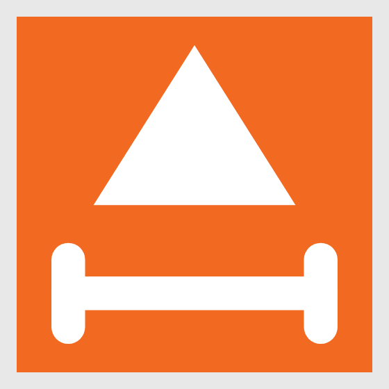
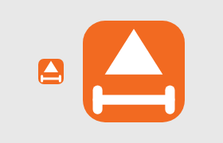

# P12 — أيقونة التطبيق وبيان الـ PWA (Agent 5)

## المشكلة (قبل)
الأيقونة المثبّتة/الظاهرة في share sheet كانت تظهر مقصوصة ومشوّهة:

- العلامة (بار الحديد) تلامس حواف اللوحة، فيقصّها القناع الدائري/الدائري المضلّع على أندرويد.
- خطوط رفيعة وغير متساوية السماكة، تختفي في الأحجام الصغيرة.
- لا توجد نسخ maskable حقيقية — البيان كان يعلن `purpose: "any maskable"` (قيمة مركّبة غير سليمة) على نفس الملفات، فلا منطقة آمنة فعلية.
- `theme_color`/`background_color` كريمية باهتة لا تطابق هوية العلامة.

| قبل (192) | قبل (apple-touch) |
| --- | --- |
|  |  |

## الحل (بعد)
علامة جديدة نظيفة: **قمّة جبل (▲) فوق بار حديد** — هوية «قِمّة». خلفية برتقالية معتمة كاملة التغطية `#F26A21`، علامة بيضاء بخطوط عريضة **متساوية السماكة** (سماكة موحّدة + أطراف دائرية)، وموسّطة بصريًا (امتداد الرأس أعلى = امتداد الأقراص أسفل).

المولّد `scripts/generate-pwa-assets.mjs` مُعاد تصميمه بالكامل (SVG → PNG عبر Playwright chromium المحلي، بلا اعتماديات جديدة) ويُخرج:

| ملف | حجم | الغرض |
| --- | --- | --- |
| `favicon.svg` | متجه | تبويب المتصفح |
| `icon-192.png` / `icon-512.png` | 192 / 512 | `purpose: "any"` — العلامة ≈ 84% من اللوحة، لا تلامس الحواف |
| `icon-maskable-192.png` / `icon-maskable-512.png` | 192 / 512 | `purpose: "maskable"` — أبعد نقطة من العلامة عند **38%** من الحجم من المركز (الحدّ القياسي 40%) |
| `apple-touch-icon.png` | 180 | خلفية معتمة — iOS يضيف تدويره بنفسه |

ملاحظة: `og-image.png` لم تُلمَس — توليدها صار خلف علم `--og` لأنها تتطلّب خطًا عربيًا مثبّتًا على جهاز التوليد (غير متوفر في بيئة العمل الحالية).

### التغييرات المرافقة
- **`public/manifest.webmanifest`**: أربع أيقونات بحقول `purpose` منفصلة (`"any"` و`"maskable"` — لا القيمة المركّبة)، و`theme_color` + `background_color` = `#F26A21`.
- **`index.html`**: `theme-color` → `#F26A21`، إضافة رابط `icon-512` و`sizes="180x180"` لأيقونة Apple.
- **`public/sw.js`**: إضافة ملفّي maskable إلى `PRECACHE_URLS` (إصدار الكاش يُحقن آليًا من هاش الـ commit منذ P11.5 — لا حاجة لأي تدخل يدوي).

## الإثبات (لقطات بالحجم الحقيقي)
مولّدة عبر Playwright (`/opt/pw-browsers/chromium`) — كل أيقونة معروضة بأبعادها الفعلية على صفحة محايدة:

| اللقطة | الملف |
| --- | --- |
|  | `icon-192.png` بحجم 192px حقيقي |
|  | `icon-512.png` بحجم 512px حقيقي |
|  | `icon-maskable-192.png` بحجم 192px حقيقي |
|  | `icon-maskable-512.png` بحجم 512px حقيقي |
|  | `apple-touch-icon.png` بحجم 180px حقيقي |
|  | `favicon.svg` بحجم تبويب حقيقي (32px) + تكبير 128px |

### إثبات المنطقة الآمنة (maskable)
محاكاة القصّ الدائري لأيقونة `icon-maskable-512.png` مع دائرة المنطقة الآمنة (نصف قطر 40% من الحجم) متقطّعة بالأبيض — العلامة كاملة داخل الدائرة، ولا شيء يُقصّ تحت القناع الدائري:


فحص بكسلات آلي (canvas) على النسختين maskable — أبعد بكسل من العلامة عن المركز:

```
PASS icon-maskable-192.png: farthest glyph pixel at 37.96% of size from center (limit 40%)
PASS icon-maskable-512.png: farthest glyph pixel at 38.00% of size from center (limit 40%)
```

## إعادة التوليد
```bash
node scripts/generate-pwa-assets.mjs        # كل الأيقونات
node scripts/generate-pwa-assets.mjs --og   # + صورة OG (يتطلّب خطًا عربيًا مثبّتًا)
```
