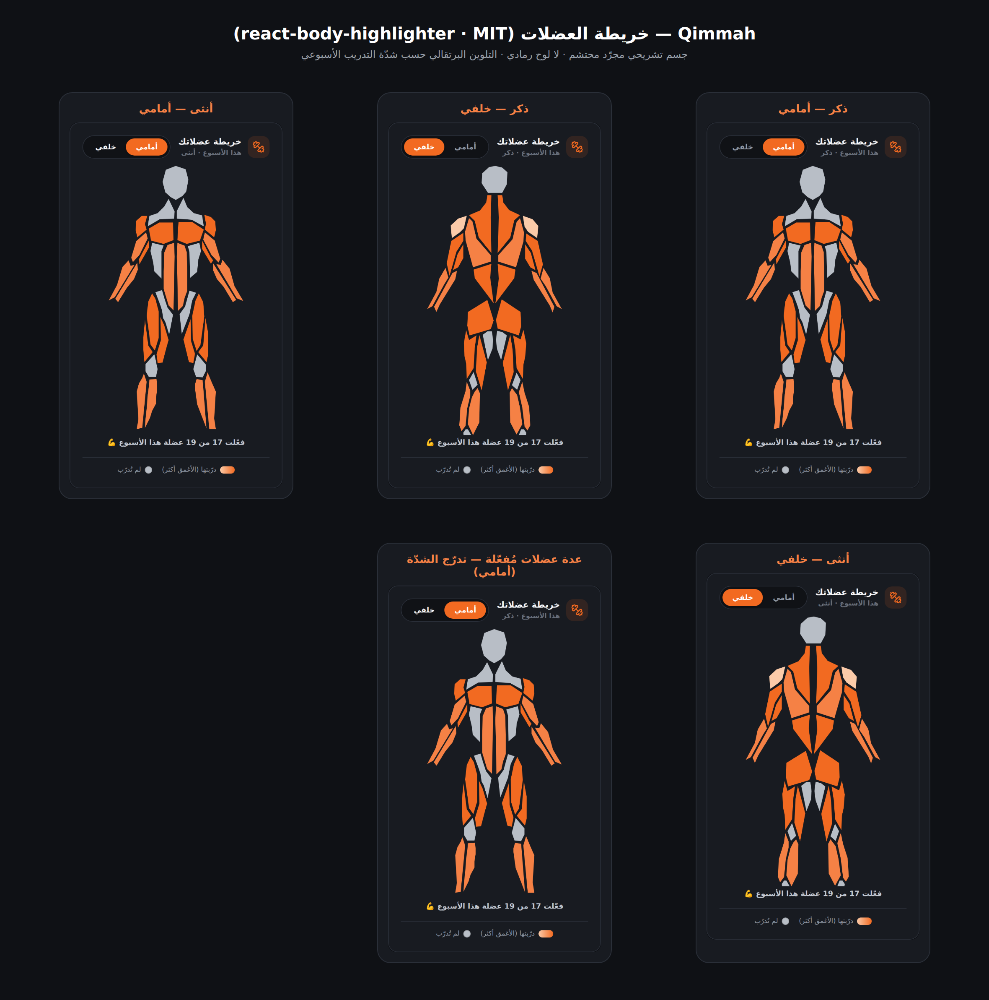

# P3.1 — استبدال خريطة العضلات المرسومة يدويًا بمكتبة موثوقة

## المشكلة
كانت خريطة العضلات تُرسم يدويًا عبر SVG في `src/data/bodyAnatomy.ts`، وظهرت رديئة في الإنتاج:
لوحٌ رمادي («شورت») يغطّي من الصدر حتى الركبة، ونِسَبٌ مشوّهة. محاولتان يدويتان فشلتا.

## الحل
التحوّل إلى مكتبة **[react-body-highlighter](https://www.npmjs.com/package/react-body-highlighter)**
— جسم تشريحي مجرّد بـ SVG، عرض أمامي/خلفي، وتلوين حسب شدّة التدريب.

| البند | القيمة |
| --- | --- |
| المكتبة | `react-body-highlighter@2.0.5` |
| الرخصة | **MIT** (متساهلة — آمنة للقالب التجاري) |
| الاعتماديات | لا شيء (peer: `react` فقط) — لا حِزَم ثقيلة |
| الحزمة | تُضاف داخل حصّة `ProgressView` فقط (تقسيم كود) |

## الاحتشام (Modesty)
جسم المكتبة **صورةٌ ظليّة تشريحية مجرّدة**: لا وجه، لا تفاصيل، لا عُري — محتشمٌ بالتصميم
لكلا الجنسين. الرأس/الرقبة يبقيان محايدين رماديين. يتحقّق شرط الاحتشام تلقائيًا.

## سلوك الجنس + الشدّة (محفوظ)
- **الجنس** يُقرأ من `OnboardingProfile` ويظهر في العنوان (ذكر/أنثى/محايد). المكتبة نموذجٌ
  واحد موحّد للجنسين (انظر المخاطر أدناه) لكن ربط الجنس محفوظ في الواجهة.
- **مبدّل أمامي/خلفي** محفوظ كما هو → `type="anterior" | "posterior"`.
- **الشدّة**: كل عضلة دُرّبت هذا الأسبوع تُضيء بدرجة برتقالية من 3 مستويات:
  - مستوى 1 (شدّة < 0.33): `#FBCBA9` (فاتح)
  - مستوى 2 (0.33–0.66): `#F58145` (متوسط)
  - مستوى 3 (≥ 0.66): `#F26A21` (برتقالي العلامة الغامق)
  - غير المُدرّبة تبقى محايدة `#B8BEC6`.

## جدول الربط (`src/data/muscleLibraryMap.ts`) — تغطية 19/19
معرّفاتنا التفصيلية → شرائح المكتبة. حيث لا مقابل دقيق نربط لأقرب عضلة أم.

| معرّفنا | شريحة المكتبة | ملاحظة |
| --- | --- | --- |
| chest_upper / chest_mid / chest_lower | `chest` | لا شرائح علوية/سفلية مستقلة → أقرب أم |
| lats / upper_back | `upper-back` | لا شريحة lats مستقلة → أقرب أم |
| traps | `trapezius` | مطابق |
| rear_delts | `back-deltoids` | مطابق |
| front_delts / side_delts | `front-deltoids` | لا شريحة جانبية → أقرب أم |
| biceps | `biceps` | مطابق |
| triceps | `triceps` | مطابق |
| forearms | `forearm` | مطابق |
| abs | `abs` | مطابق |
| obliques | `obliques` | مطابق |
| lower_back | `lower-back` | مطابق |
| quads | `quadriceps` | مطابق |
| hamstrings | `hamstring` | مطابق |
| glutes | `gluteal` | مطابق |
| calves | `calves` | مطابق |

**التغطية:** كل الـ19 معرّفًا الداخلي مربوط (100%). تنطوي بعض المعرّفات على شريحة واحدة
(نأخذ أعلى شدّة عند التجميع). شرائح المكتبة بلا مقابل داخلي (head/neck/knees/adductor…)
تبقى محايدة.

## ما حُذف
- `src/data/bodyAnatomy.ts` (الرسم اليدوي كاملًا: الصورة الظليّة، العضلات، **ولوح اللباس الرمادي**).
- كل منطق `buildSilhouette / buildClothing / buildFrontRegions / buildBackRegions` — لم يعد مُستوردًا.

## الإثبات البصري
عُرضت الشاشة headless (Chromium) بخمس حالات: ذكر أمامي، ذكر خلفي، أنثى أمامي،
أنثى خلفي، وواحدة بعدة عضلات مُفعّلة بتدرّج شدّة. الجسم نظيف: **لا لوح رمادي**،
النِّسَب صحيحة، والعضلات تتلوّن برتقاليًا حسب الشدّة.



إعادة الإنتاج:
```bash
npm run dev -- --port 5199        # نافذة 1
npm i --no-save playwright-core   # أداة مؤقتة
node scripts/p31-muscle-proof.mjs # نافذة 2 → docs/product/assets/p31-muscle-map.png
```

## البوابات
| البوابة | النتيجة |
| --- | --- |
| `npm run typecheck` | ✅ يمرّ |
| `npm run lint` (max-warnings 0) | ✅ يمرّ |
| `npm run build` | ✅ يمرّ |

## المخاطر / ملاحظات
1. **نموذج واحد للجنسين:** المكتبة لا تملك جسمًا أنثويًا منفصلًا؛ فالعرض متطابق بصريًا
   لكلا الجنسين (يختلف نص العنوان فقط). مقبولٌ لأن الجسم مجرّد ومحتشم أصلًا. إن طُلب لاحقًا
   تمييز أنثوي، يلزم مكتبة/أصول SVG بديلة.
2. **تجميع الشرائح:** بعض عضلاتنا التفصيلية (صدر علوي/سفلي، جانبي الكتف) تندمج في شريحة
   أمّ واحدة؛ فلا تظهر منفصلةً على الخريطة (لكن حسابات التغطية تبقى تفصيلية كما هي).
3. **`react-body-highlighter` بلا سمات a11y** على العضلات؛ عوّضناها بـ `role="img"` و`aria-label`
   وصفيّ على الحاوية، ومبدّل الجهة يبقى وصولًا بالكيبورد.
4. لا مخاطر أمنية جديدة: المكتبة MIT، بلا اعتماديات، بلا شبكة، بلا أسرار.
