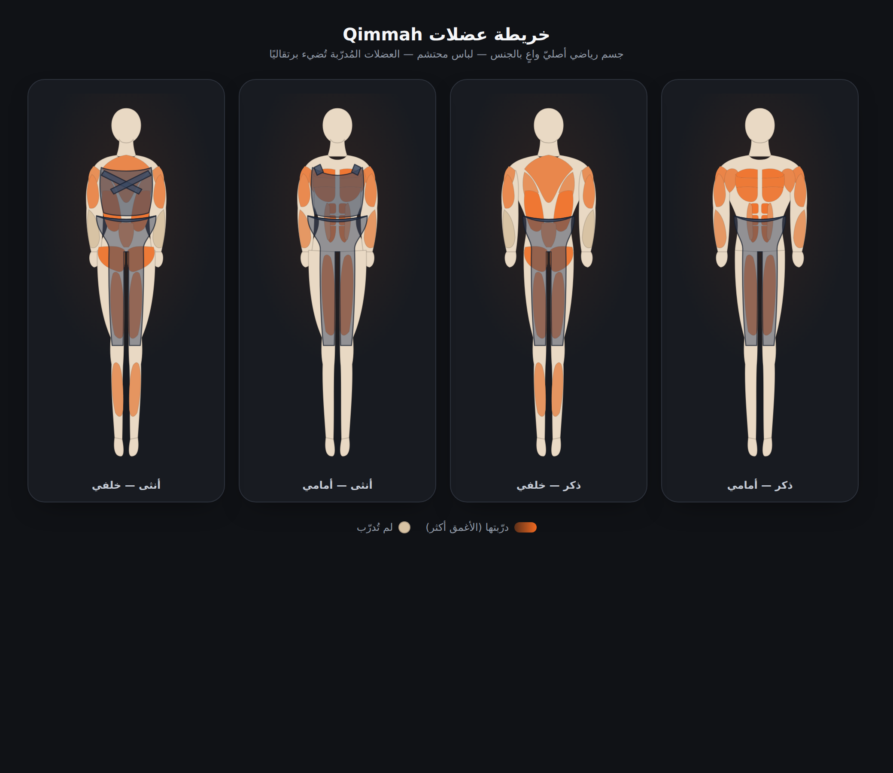

# P3 — Agent 4: تصميم بصري، إعادة رسم خريطة العضلات، لمسة احترافية

**الفرع:** `claude/p3-design-muscle-map-os5wuy`
**النطاق:** التصميم البصري + خريطة العضلات + التفاعلات الدقيقة + حالات الفراغ/التحميل + نبرة خليجية + إمكانية الوصول.

> ملاحظة تنسيق: الوصف الأصلي أشار إلى `integration/phase3`/`feature/p3-design`، لكن قاعدة الفرع الصارمة لهذه الجلسة (وعدم وجود `integration/phase3` على الريموت) تفرض التطوير والدفع على `claude/p3-design-muscle-map-os5wuy` فقط. التزمتُ بذلك.

---

## 1) خريطة العضلات — إعادة رسم أصليّة

استُبدل الرسم القديم (أشكال بيضاوية بدائية) بجسم رياضيّ **أصليّ** مرسوم بالكامل بمسارات SVG في
`src/data/bodyAnatomy.ts` — بلا أي نسخ من صور/منافسين.

- **قوام V رياضي:** أكتاف عريضة، خصر منحوت، انحدار لاتس واضح.
- **واعٍ بالجنس:** كل الأبعاد مشتقّة من `PROPS[gender]` (كتف/خصر/ورك/رقبة)؛ الذكر عريض الكتف، الأنثى أضيق كتفًا وأوسع وركًا. العضلات والملابس تتحرّك تلقائيًا مع القوام.
- **عضلات معرّفة تشريحيًا:** دالية جانبية/أمامية/خلفية، صدر بثلاث شرائح، بايسبس/ترايسبس، ساعد، «سِكس‑باك» من كتل، جوانب بطن، كوادس، ترابيس، لاتس، أسفل الظهر، ألوية، هامسترنغ، سمانة.
- **الإضاءة:** كل عضلة دُرّبت تُضيء برتقاليًا بدرجة تتناسب مع شدّة التغطية (انتقال ناعم يحترم تقليل الحركة).
- **الحياء (لجمهور سعودي/خليجي):** شورت طويل إلى الركبة يغطّي من فوق السرّة للجميع؛ الأنثى تُضاف لها **توب رياضي ساتر** يغطّي الصدر والوسط بحمّالات. الملابس شبه شفّافة كي يظهر تلوين العضلة مع حدّ وحزام واضحين يؤكّدان اللباس.
- **رأس مجرّد بلا ملامح:** يتفادى أي حقوق ويُبقي المظهر نظيفًا.
- تناظر دقيق: يُرسم الجانب الأيسر ويُعكس آليًا (`mirrorPath`).

**الإثبات (لقطة headless):** `docs/product/assets/p3-muscle-map.png`
تعرض الحالات الأربع (ذكر/أنثى × أمامي/خلفي) مع توزيع تغطية تجريبي.
مولّدة عبر `scripts/render-muscle-map.mjs` (أداة تطوير — تُشغّل يدويًا، خارج حزمة الإنتاج).

كوّن المكوّن `src/components/WeeklyMuscleMap.tsx`: أُضيف توهّج خلفيّ دافئ، ألوان مُعايَرة،
انتقال ناعم على الإضاءة، ومبدّل جهة عرض بأهداف لمس أكبر و`role="group"`.

## 2) لمسة احترافية شاملة

- **ظلال معايَرة للثيم الداكن** (`tailwind.config.js`): أساس أسود لعمق حقيقي على خلفية `#101216` بدل الظلال الدافئة الباهتة، مع `shadow-elevated` جديد.
- **بطاقات:** صنف `.card-interactive` (ارتفاع خفيف + حدّ برتقالي عند المرور + ضغطة عند اللمس).
- **الأزرار:** حدّ أدنى للارتفاع 44px، حلقات تركيز واضحة، ضغطة `active:scale`.
- **البرتقالي بقصد:** يُستخدم للإجراء الأساسي والإضاءة والتوهّج فقط — لا زخرفة عشوائية.
- شبكة الميزات في اللوحة تحوّلت إلى بطاقات تفاعلية بكشف متدرّج.

## 3) تفاعلات دقيقة (تحترم reduced-motion)

- رسوم جديدة: `fade-in`, `pop-in`, `shimmer` إضافةً إلى `fade-up`.
- أدوات: `.press` (ضغطة لمس)، انتقالات على المبدّلات/الأزرار/البطاقات.
- **حاجز شامل** في `styles/index.css`: `@media (prefers-reduced-motion: reduce)` يوقف كل الرسوم/الانتقالات؛ وكل عنصر متحرّك يحمل `motion-reduce:animate-none`.

## 4) حالات الفراغ والتحميل + هياكل

بدائل مشتركة قابلة لإعادة الاستخدام:
- `src/components/Skeleton.tsx`: `Skeleton`, `SkeletonCard`, `LoadingBoundary` (بمنطقة حيّة للقارئات).
- `src/components/EmptyState.tsx`: حالة فارغة ودودة بنبرة خليجية دافئة + زر إجراء اختياري.
- `MuscleCoverageGridSkeleton` + حالة فراغ مدمجة في شبكة تغطية العضلات.
- صنف `.skeleton` (نبض + لمعان) يُخفي اللمعان عند تقليل الحركة.

## 5) نبرة خليجية

الملف `strings.ts` كان أصلًا خليجيًا في معظمه؛ حصرتُ تعديلي في القيم دون حذف أي مفتاح:
- `start.welcome`: «أهلاً بك…» → «هلا فيك في قِمّة».
- `workout.savedTitle/savedBody`: نبرة تشجيعية «يعطيك العافية! حفظنا تمرينك».
- بقية الدفء في مكوّناتي (تعليقات الخريطة والحالات الفارغة): «يوم تبدأ تمرينك بتتلوّن عضلاتك»، «ما فيه تغطية بعد».

## 6) إمكانية الوصول

- أهداف لمس ≥ 44px للأزرار والمبدّلات.
- `aria-label`/`aria-pressed`/`role="group"` على مبدّل جهة العرض؛ `role="img"` + وصف حيّ للخريطة؛ كل عضلة عنصر تفاعلي بلوحة مفاتيح (`Enter`/`Space`).
- تباين محسّن للظلال والحدود على الثيم الداكن؛ `aria-busy`/`aria-live` في غلاف التحميل.

---

## البوابات
`npm run typecheck` ✅ · `npm run lint` ✅ · `npm run build` ✅

## المخاطر / ملاحظات التنسيق
- **strings.ts مشترك:** عدّلتُ قيمًا فقط (لا حذف مفاتيح). عند تعارض الدمج: **الإبقاء على مفاتيح الطرفين**.
- **حالات الفراغ/التحميل على مستوى الشاشات** (تغذية/تمرين): قدّمتُ البدائل المشتركة الجاهزة للتبنّي، وطبّقتها ضمن الأسطح التي أملكها (خريطة/تغطية العضلات + اللوحة) تفاديًا للتصادم مع تعديلات وكلاء آخرين على تلك الشاشات.
- `scripts/render-muscle-map.mjs` أداة تطوير تعتمد `playwright` (غير مثبّت في الإنتاج) و`esbuild` (متوفّر عبر Vite)؛ ليست جزءًا من البناء.
