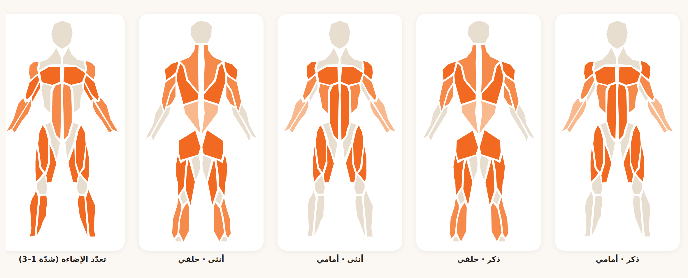

# P4 · A1 — استبدال خريطة العضلات بمكتبة react-body-highlighter

## المشكلة
كانت خريطة العضلات مرسومة يدويًا بـ SVG (`src/data/bodyAnatomy.ts`) مع طبقة «لباس رمادي»
تغطّي من الصدر إلى الركبة، فظهرت رديئة وغير احترافية. محاولتان يدويّتان فشلتا.

## الحل
اعتماد مكتبة ناضجة ومجرّبة بدل الرسم اليدوي:

- **المكتبة:** [`react-body-highlighter`](https://www.npmjs.com/package/react-body-highlighter) v2.0.5
- **الرخصة:** **MIT** (رخصة متساهلة — صالحة للاستخدام التجاري).
- **الاعتماديات:** لا اعتماديات إنتاجية إضافية (React فقط كـ peer). نموذج SVG تشريحيّ نظيف.

## المكوّنات المعدّلة
- **حُذف:** `src/data/bodyAnatomy.ts` (الرسم اليدوي + طبقة اللباس الرمادي) بالكامل.
- **أُضيف:** `src/lib/muscleMapLib.ts` — جسر التحويل (خريطة العضلات + تدرّج الألوان + حساب الشدّة).
- **أُعيدت كتابته:** `src/components/WeeklyMuscleMap.tsx` — يعرض `<Model>` بدل الـ SVG اليدوي.

## جدول التحويل (معرّفاتنا → شرائح المكتبة)
التفصيلي يُجمَّع إلى الأب الأقرب، وتُؤخذ **أعلى شدّة** عند التجميع.

| معرّفنا | شريحة المكتبة | ملاحظة |
|---|---|---|
| `chest_upper`, `chest_mid`, `chest_lower` | `chest` | ثلاثتها → الصدر (لا تجزئة صدر في المكتبة) |
| `lats` | `upper-back` | أقرب رقعة ظهرية |
| `upper_back` | `upper-back` | — |
| `traps` | `trapezius` | — |
| `rear_delts` | `back-deltoids` | — |
| `front_delts` | `front-deltoids` | — |
| `side_delts` | `front-deltoids` | لا كتف جانبيّ مستقل — يُدمج بالأمامي |
| `biceps` | `biceps` | — |
| `triceps` | `triceps` | — |
| `forearms` | `forearm` | — |
| `abs` | `abs` | — |
| `obliques` | `obliques` | — |
| `lower_back` | `lower-back` | — |
| `quads` | `quadriceps` | — |
| `hamstrings` | `hamstring` | — |
| `glutes` | `gluteal` | — |
| `calves` | `calves` | — |

**التغطية:** كل الـ 19 عضلة في تصنيفنا مربوطة (16 شريحة مكتبة). لا عضلة بلا تحويل.

## الألوان والشدّة
- تدرّج برتقالي التطبيق: `#F9B98E` (شدّة 1) → `#F58A4B` (2) → `#F26A21` (3).
- الشدّة تُشتقّ من `intensity` في التغطية الأسبوعية: `≥0.85`→3، `≥0.45`→2، غير ذلك→1.
- غير المُدرّبة = لون محايد `#E7DECF` (تشجيع بلا أحكام).

## الجنس والجهة
- الجهة: مبدّل **أمامي/خلفي** (`anterior`/`posterior`) محفوظ كما هو.
- الجنس: يُقرأ من `OnboardingProfile` ويظهر في العنوان (ذكر/أنثى/محايد).
- **قيد المكتبة:** `react-body-highlighter` v2 يوفّر نموذجًا تشريحيًا مجرّدًا واحدًا فقط
  (أمامي/خلفي) بلا نموذج أنثوي منفصل، فيظهر الجسم نفسه للجنسين. النموذج محتشم
  ومجرّد بطبيعته (بلا لباس رمادي). القيمة تُقرأ وتُعرض؛ لو لزم لاحقًا نموذج أنثوي
  مستقل فهو خارج نطاق هذه المكتبة.

## الإثبات (Headless render)
تم توليد الصورة عبر Chromium بلا واجهة (Playwright) — خمس لوحات:
ذكر-أمامي، ذكر-خلفي، أنثى-أمامي، أنثى-خلفي، + تعدّد الإضاءة (شدّة 1–3).
تحقّق آليّ: 5 عناصر `<svg>` رُسمت، **بلا أخطاء Console**.

**المعاينة نظيفة:** نِسَب تشريحية صحيحة، بلا لوحة لباس رمادية، تلوين شدّة متدرّج،
عضلات غير مُدرّبة محايدة، ونصوص عربية RTL سليمة.

## البوابات
| البوابة | النتيجة |
|---|---|
| `npm install` | ✅ |
| `npm run build` | ✅ |
| `npm run lint` | ✅ (0 تحذيرات) |
| `npm run typecheck` | ✅ |
| Headless screenshot | ✅ `docs/product/assets/p4-muscle-map.png` |

## المخاطر
- **لا نموذج أنثوي في المكتبة** — يظهر النموذج نفسه للجنسين (موثّق أعلاه).
- **تفقد التجزئة الدقيقة** — صدر علوي/أوسط/سفلي يُدمج في `chest` واحد؛ اللاتس والظهر
  العلوي يشتركان في `upper-back`. الشدّة تُحفظ بأخذ الأعلى.
- **حجم الحزمة** — المكتبة تضيف مسارات SVG للنموذج؛ الأثر بسيط والبناء أخضر.
