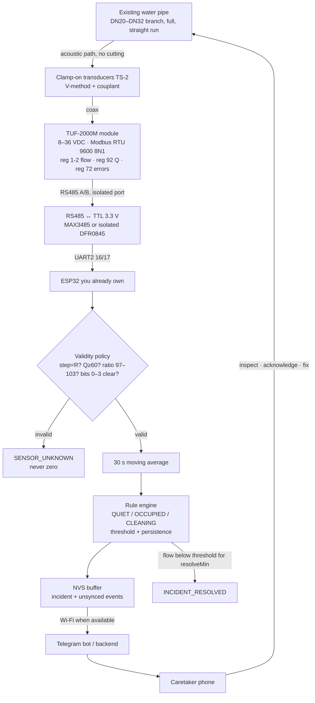
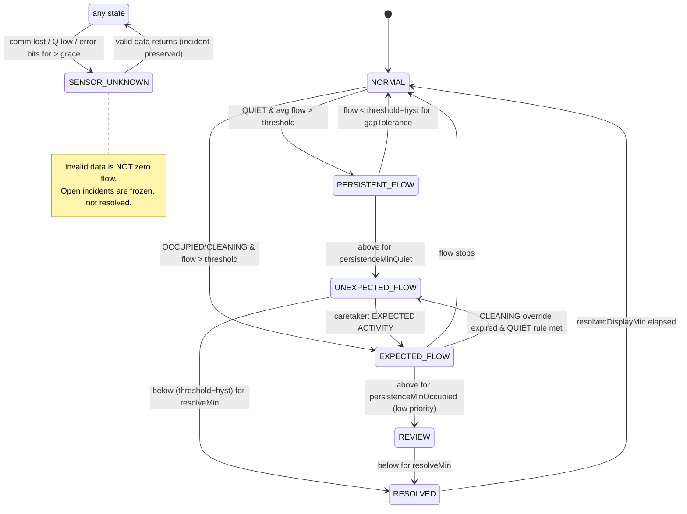

# Water Guardian — Architecture diagrams (Mermaid)

Render with any Mermaid viewer (GitHub, VS Code, mermaid.live). SVG copies: `architecture.svg`, `wiring.svg`, `hydraulic_layout.svg`.

## 1. System architecture (MVP)



## 2. Detection state machine



## 3. Wiring (see wiring.svg for the drawn version)

```mermaid
flowchart LR
  PSU[24 VDC PSU 1 A<br/>(12 V also OK: meter 8–36 V)] -->|+24 V / GND| M[TUF-2000M<br/>terminals 8~36V+ / −]
  PSU -->|+24 V| B[LM2596 buck → 5 V]
  B -->|5 V → VIN| E[ESP32 DevKit]
  M -->|485+ A| X[RS485 module<br/>A B GND]
  M -->|485− B| X
  X -->|RO / RXD| E16[ESP32 GPIO16 RX2]
  X -->|DI / TXD| E17[ESP32 GPIO17 TX2]
  X -->|DE+RE| E4[ESP32 GPIO4<br/>(omit on auto-direction module)]
  X -->|VCC 3.3 V| E33[ESP32 3V3]
  X -->|GND| EG[ESP32 GND]
  M -.->|GND reference only if module NOT isolated| EG
  TR[120 Ω termination<br/>at far end only] --- X
```
